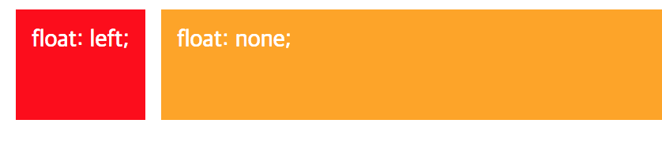
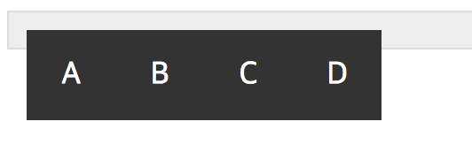

# 1. Today I Learned

## float

---

float 프로퍼티는 주로 layout 을 구성하기 위해 사용되는 핵심 기술입니다. 
layout 의 가장 큰 목적은 1 개 이상의 요소를 원하는 위치에 정렬시키는 것입니다. 
float 프로퍼티는 본래 이미지와 텍스트가 있을 때, 이미지 주위를 텍스트로 감싸기 위해 만들어진 것입니다.  

  
float 프로퍼티는 요소가 기본 레이아웃 흐름에서 벗어나 요소의 모서리가 페이지의 왼쪽이나 오른쪽에 이동할 수 있도록 해줍니다. 
단, float 프로퍼티를 사용할 때 요소의 위치를 고정시키는 position 프로퍼티의 absolute 를 사용하면 안됩니다.  

| 프로퍼티값 | Description                                              |
| ---------- | -------------------------------------------------------- |
| none       | float 프로퍼티의 기본값으로 적용되지 않은 것과 같습니다. |
| right      | 요소를 오른쪽으로 이동시킵니다.                          |
| left       | 요소를 왼쪽으로 이동시킵니다.                            |

 

float 프로퍼티를 사용하지 않은 블록 요소들은 수직으로 정렬되는데 `float:left;`를 사용하면 왼쪽부터 정렬되고, `float:right;`를 사용하면 오른쪽부터 정렬됩니다. 
오른쪽 정렬의 경우, 먼저 기술된 요소가 가장 오른쪽에 출력되므로 출력 순서가 역순이 됩니다. 
float 프로퍼티의 경우 좌,우 정렬만 가능할 수 있으며, 가운데 정렬을 하고자 한다면 margin 프로퍼티를 사용해야 합니다.  

  

  
(box5를 제외한 box1, box2, box3, box4에 순서대로 float:left를 적용한 부분 
box5를 제외한 나머지는 content에 맞게 최소화되었음을 볼 수 있고, box5는 오른쪽에 떠 있게 되었습니다.)
  

## float 프로퍼티 관련 문제 해결 방법

---

### float 프토퍼티가 선언된 요소와 선언되지 않은 요소간 margin 이 사라지는 문제

두 요소는 차례대로 정렬된 것처럼 보이지만 float 프로퍼티가 선언된 요소가다음 요소 위에 떠 있는 상태입니다. 따라서 두 요소간의 margin 은 제대로 표현되지 않습니다.  두번째 요소의 float:none;으로 인해 일어나는 박스 모델상의 문제입니다. 
문제를 해결하는 쉬운 방법으로는 float 을 선언하지 않은 두번째 요소에 `overflow:hidden` 프로퍼티를 선언하는 방법이 있습니다. 
overflow:hidden 프로퍼티는 자식요소가 부모 요소의 영역보다 클 경우 넘치는 부분을안보이게 해주는 역할을 하는데 여기서는 float 프로퍼티가 없어서 제대로 표현되지 않는요소를 제대로 출력해줍니다. 
두번째 요소에 float 프로퍼티를 선언하면 overflow:hidden 프로퍼티는 없어도 되지만요소의 너비가 최소화 됩니다.  

### float 프로퍼티를 가진 자식 요소를 포함하는 부모 요소의 높이가 정상적으로 반영되지 않는 문제

  
float 이라는 속성은 앞에서 알아봤지만, 기본적으로 요소가 띄어지게 만드는 속성을 갖고 있습니다. 그렇기 때문에 요소가 띄어진 상태에서 부모 요소는 띄어진 자식 요소를 인식하지 못합니다. 오로지 float 되지 않은 요소들만 인식합니다. 
이를 해결하기 위해서는 4 가지 방법이 있습니다.  

1.  overflow:hidden 프로퍼티 사용하는 방법  
    * 원래 overflow:hidden 의 기능과 다른 용도로 사용하여 이슈를 해결하는 것인데 현업에서 많이 쓰이는 방법이지만  새로운 디자인이 적용될 때 다시 문제가 될 수 있어 가급적 사용하지 않는 것이 좋습니다.  
2.  부모영역이 끝나기 직전 빈 요소를 만들고 clear:path;를 설정하는 방법  
    * 의미 없는 빈 요소를 사용하는 방법이기 때문에 좋지 않다고 할 수 있습니다.  
3.  <strong style="color:lightpink">::after 가상 요소 선택자를 이용하는 방법</strong>  

    * 부모요소 아래에 .clearfix:after(구버젼도 지원하는 CSS2 문법)라는 클래스를 추가하고. 
      해당 요소를 선택하여 클리어 문법을 선언하면 되서 가장 좋은 방법이라고 할 수 있습니다.  
      clearfix:after { 
      &nbsp;&nbsp;&nbsp;&nbsp;&nbsp;&nbsp;content: ""; 
      &nbsp;&nbsp;&nbsp;&nbsp;&nbsp;&nbsp;display: block; 
      &nbsp;&nbsp;&nbsp;&nbsp;&nbsp;&nbsp;clear: both; 
      } 

4.  display: inline-block 선언하는 방법
    * float 이 선언된 요소에 float 프로퍼티를 지우고 display: inline-block;을 선언해주면 됩니다. 

   

## layout_example

---

Layout 의 다양한 템플릿을 보고자 하면 도움될만한 사이트입니다.

> http://naradesign.net/ouif/layout/index.html

> https://www.noupe.com/essentials/freebies-tools-templates/css-layouts-40-tutorials-tips-demos-and-best-practices.html

  

## 꼭 기억하기!!

---

* float 된 요소는 기본적으로 상위 요소가 영역을 파악하지 못합니다. (float 이 요소를 띄웁니다.)
* float 는 띄어지기 떄문에, 보통 다음 블록 요소는 float 된 요소 밑에 깔리게 됩니다.
* 블록 요소는 기본적으로 float 을 인식하지 못합니다. 텍스트, 인라인 요소, 그리고 float 된 요소만 다른 float 요소를 인식합니다.
* float 된 요소를 부모 요소가 포함하기 위해, height 로 임의의 높이 값을 줄 수 있지만 
  내부 float 의 요소의 높이가 바뀔 때마다 직접 바꿔줘야 합니다. (비추)
* float 된 요소들 다음에 비어있는 div 에 clear:both 속성을 주어 부모가 높이를 자동으로 인식할 수 있게 해줍니다. (하지만 이 또한 좋은 방법은 아닙니다.)
* float 된 요소들의 부모 요소에 overflow:hidden 을 줄 경우, 부모 요소는 float 된 요소를 인식합니다.
* overflow:hidden 은 자식 요소의 margin 값도 내부로 인식하게 합니다.
* float 된 요소의 부모가 float 될 경우, 부모 요소는 자식 요소를 인식 합니다. (float 으로 float 해결하기)
* float 될 경우, 기존 블록 요소처럼 너비가 넓게 퍼지지 않고, 콘텐츠크기에 맞게 최소화됩니다.

# 2. Today I Found Out

지난 주에 flex 를 배우면서 이게 얼마나 편리한 것인지 몰랐는데 오늘 알았습니다. 
float 에 대해서 수업을 듣는 초반에는 flex 가 보고싶어지고 참 이해가 어렵다 싶었는데 
또 수업을 듣고 공부를 하다보니 어느샌가 이해가 되었고, float 을 가지고 실습을 해보면서 
친해지고 있습니다. 항상 낯선 것들을 배울 때 처음 느끼는 낯설음이 어렵다는 인식을 가지고 
해당하는 지식들을 밀어내는 것 같은데 이번 프론트엔드 과정을 하는 동안 새로운 기술과 친해지는 
계기를 만들어서 낯설더라도 이해하려고 노력하는 모습을 초반뿐만 아니라 개발자가 되어서도 이어나가도록 
노력하겠습니다.
