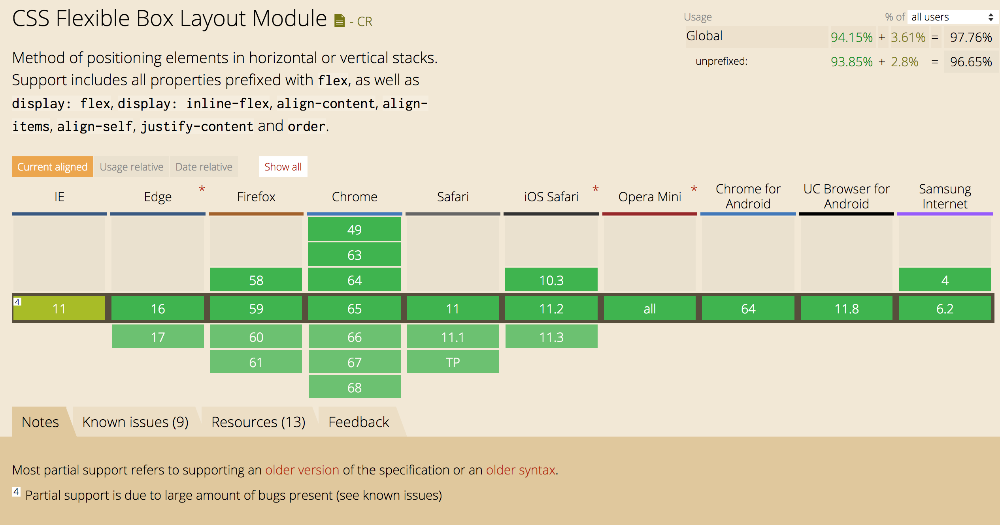
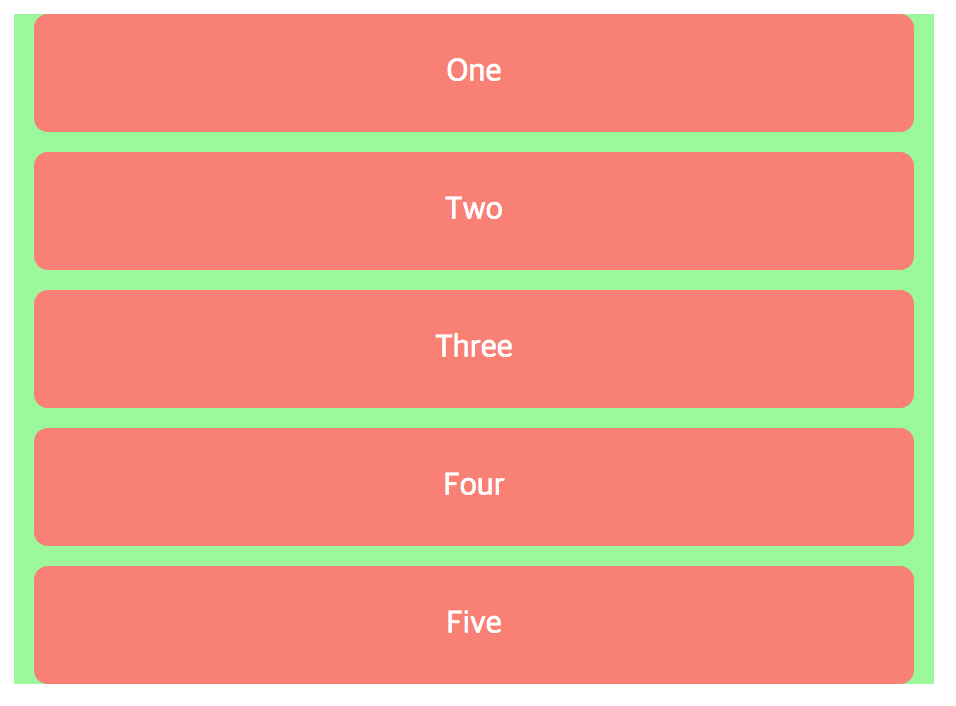
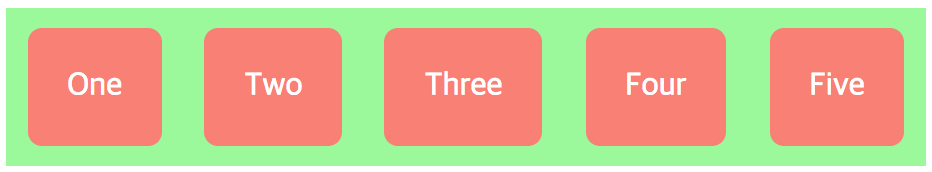

# 1. Today I Learned

## flexbox

---

`flexbox`는 모던 웹을 위하여 제안된 기존 layout 보다 더 세련된 방식의 니즈에 부합하기 위한 CSS3 의 새로운 layout 방식입니다.<br/>
요소의 사이즈가 불명확하거나 동적으로 변화할 때에도 유연한 레이아웃을 실현할 수 있습니다.<br/>
복잡한 레이아웃이라도 적은 코드로 보다 간단하게 표현할 수 있는 장점이 있습니다.<br/><br/>


예전에는 몇몇 브라우저에서만 작동하였지만 현재는 많은 브라우저들이 flexbox layout 을 지원하고 있습니다.<br/>
flexbox 에 대해 공부하기 전에 간단한 레이아웃을 만들었습니다.<br/>

```html
<!DOCTYPE html>

<html>
    <head>
        <style>
            .flex-box {
                background: palegreen;
                width: 460px;
            }

            .flex-item {
                background: salmon;
                padding: 20px;
                margin: 10px;
                color: #fff;
                border-radius: 7px;
                text-align: center;
            }
        </style>
    </head>
    <body>
        <div class="flex-box">
            <div class="flex-item">One</div>
            <div class="flex-item">Two</div>
            <div class="flex-item">Three</div>
            <div class="flex-item">Four</div>
            <div class="flex-item">Five</div>
        </div>
    </body>
</html>
```


<br/>

div 는 block 요소의 성질이므로 수직 정렬됩니다.<br/>
수평 정렬을 하기 위해서는 자식 요소에 `display:inline-block;`을 선언하거나
`float:left;`를 지정해야했습니다.<br/>
이렇게 수평 정렬을 하면 부모 요소 내에서 각 자식의 요소의 너비를 다시 지정하는 등..<br/>
번거로운 처리가 필요했는데 flexbox 를 이용하면 간단하게 부모 요소내에서<br/>
자식요소의 수평 정렬이 가능합니다.<br/>

```css
.flex-box {
  display: flex;
  justify-content: space-around;
  background: palegreen;
  width: 460px;
}
```



부모 요소에 `display:flex;`와 `justify-content: space-around;`<br/>
기존 코드에 단 두 줄의 코드를 추가했을 뿐인데 원하는 대로 수평 정렬을 시켰습니다.<br/>
이처럼 flexbox 는 기존에 방식에 비해 매우 간단히 레이아웃을 처리할 수 있습니다.<br/>원리는 부모 요소에 `display:flex`를 지정하면서 부모 요소는
flex-container 가 되고<br/>자식 요소는 자동적으로 flex-item 이 됨으로부모 요소(flex-container)에서<br/>
콘텐츠 조정(justify-content)을 통해 자식 요소(flex-item)가 정렬 되는 것입니다.<br/>

<br/><br/>

### flexbox 의 장점

---

* 소량의 코드 추가로 다양한 정렬이 가능합니다.
* 요소의 상하좌우 정렬, 순서 변경이 가능합니다.
* 요소의 간격 조절이 간단합니다.
* 서로 다른 height 를 갖는 요소의 수평정렬 시, 간단히 상하중앙 정렬이 가능합니다.
  <br/><br/>

  점차 많은 브라우저에서 flexbox 를 지원하지만 비교적 최신 브라우저가 아니면 벤더 프리픽스를 사용하여야 하고,<br/>IE8,9 의 경우는 지원하지 않고, IE10,11 도 일부만을 지원함으로, 주의가 필요합니다.<br/>

<br/><br/>

### flexbox container 속성

---

* `flex-direction` : 컨테이너의 주축 방향을 설정합니다.<br/>
  (값으로는 `row`(수평-기본값),`row-reverse`,`column`(수직),`column-reverse` 가 올 수 있습니다.)

* `flex-wrap` : flex container 의 복수 flex item 을 1 행 또는 복수행으로 배치합니다.<br/>
  (값으로는 `nowrap`(줄바꿈을 하지않고 1 줄로 배치한다.),<br/>
  `wrap`(flex item 의 너비 값의 합계가 container 보다 큰 경우 복수행으로 배치한다.)<br/>
  `wrap-reverse`(wrap 과 동일하지만 아래에서 위로 거꾸로 배치됩니다.) 가 올 수 있습니다.)

* `flex-flow` : `flex-direction`와 `flex-wrap`을 설정하기 위한 속기프로퍼티입니다.<br/>
  (기본값은 row, nowrap 입니다.)<br/>

* `justify-content` : flex container 의 주축을 기준으로 flex item 을 정렬합니다.<br/>
  (값으로는 `flex-start`(좌측을 기준으로 정렬-기본값),
  `flex-end`(우측을 기준으로 정렬), `center`(중앙을 정렬),<br/> `space-between`(첫번째와 마지막 flex item 은 좌우 측면에 정렬, 나머지는 균등한 가격으로 정렬),<br/>
  `space-around`(모든 flex item 의 균등한 간격으로 정렬)가 올 수 있습니다.)<br/>

* `align-items` : flex itme 을 container 의 수직 방향으로 정렬합니다.<br/>
  align-items 속성은 모든 flex-item 에 적용됩니다.<br/>
  (값으로는 `stretch`(모든 flex item 은 container 의 높이에 꽉찬 높이를 갖음-기본값),<br/>
  `flex-start`(flex container 의 가로 시작선(위) 기준으로 정렬),<br/>
  `flex-end`(flex container 의 가로 종료선(아래) 기준으로 정렬)),<br/>
  `center`(가운데 정렬), `baseline`(폰트기준으로 아래선(\_) 정렬)이 올 수 있습니다.)<br/>

* `align-content` : flex container 의 가로축을 기준으로 flex item 을 수직 정렬합니다.<br/>
  (값으로는 `stretch`(모든 flex item 은 flex item 행 이후에 균등하게 분배된 공간에 정렬되어 배치-기본값),<br/>`flex-start`(flex container 의 가로 시작선(위)를 기준으로 stack 정렬)<br/>`flex-end`(flex container 의 가로 종료선(아래)를 기준으로 stack 정렬)<br/>`center`(가운데 배치),<br/> `space-between`(첫번째 flex item 은 상단에, 마지막 flex item 은 하단에 배치되고, 나머지 행은 균등 분할된 공간에 배치)<br/>
  `space-around`(균등 분할된 공간 내에 배치 정렬)가 올 수 있습니다. )

  <br/><br/>

### flexbox item 속성

---

`float`, `clear`, `vertical-align` 속성은 flex-item 에 영향을 주지 않습니다.

* `order` : flex-item 의 배치 순서를 지정합니다.<br/>
  기본값은 0 이며 order 의 값이 높을수록 우선 순위를 가집니다.<br/>

* `flex-grow` : flex item 의 너비에 대한 확대 인자를 지정합니다.<br/>
  기본값은 0 이고 음수 값은 무효입니다.<br/>
  모든 flex-item 이 동일한 flex-grow 속성값을 가지면 모든 flex item 은 동일한 너비를 갖습니다.<br/>
  한 flex item 의 flex-grow 속성값을 3 으로 지정하면 다른 flex item 보다 더 넓은 너비를 갖습니다.<br/>

* `flex-shrink` : flex item 의 너비에 대한 축소 인자를 지정합니다.<br/>
  기본값은 0 이고 음수 값은 무효입니다.<br/>
  0 을 지정하면 축소가 해제되어 원래의 너비를 유지합니다.<br/>

* `flex-basis` : flex item 의 너비 기본값을 px, % 등의 단위로 지정합니다.<br/>
  기본값은 auto 입니다.<br/>

* `flex` : `flex-grwo`, `flex-shrink`, `flex-basis`의 속기 프로퍼티로<br/>
  기본값은 0 1 auto 입니다.<br/>
  W3C 에서는 속기 프로퍼티를 이용하는 것보다 각 항목별로 개별적으로 기술하는 것을 추천하고 있습니다.<br/>

* `align-self` : align-items 속성보다 우선하여 개별 flex item 을 정렬합니다.<br/>
  기본값은 auto 입니다.<br/>
  값으로는 auto, flex-start, flex-end, center, baseline, stretch 가 올 수 있습니다.

<br/><br/>

# 2. Today I Found Out

```
어제 Grid에 이어 Flex까지 float를 이용하여 배치를 하다가 새로운 기술들을
사용하니 얼마나 편리한지 실감할 수 있었습니다.
물론 다양한 브라우저에서 보편화가 되고 문제없이 작동할려면 시간이 걸리겠지만
그래도 점점 기술들이 웹 개발에 있어 생산성을 높여주는 것 같아 좋았습니다.
```

<br/><br/>

# 3. refer

> https://developer.mozilla.org/en-US/docs/Web/CSS/flex

> https://www.w3schools.com/cssref/css3_pr_flex.asp

> http://poiemaweb.com/
