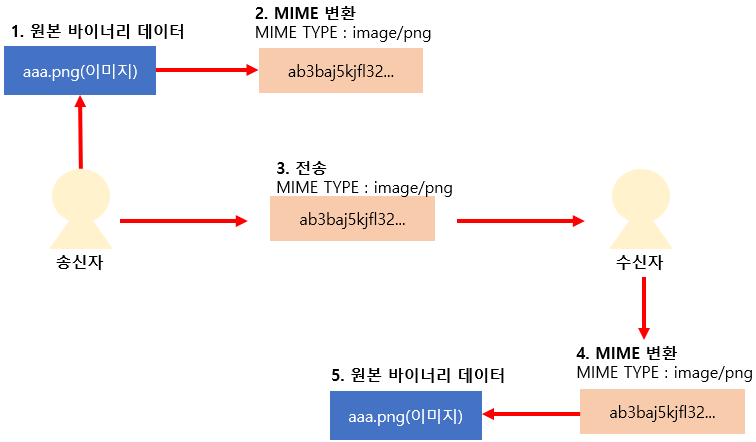

# 1. Today I Learned

## Node.js

---

## Rest API 실습

REST API 란?

REST(Representational State Transfer)는<br/>
월드 와이드 웹과 같은 분산 하이퍼미디어 시스템을 위한 소프트웨어 아키텍처의 한 형식으로,<br/>
엄격한 의미로 REST 는 네트워크 아키텍처 원리의 모음입니다.<br/>
여기서 '네트워크 아키텍처 원리'란 자원을 정의하고 자원에 대한 주소를 지정하는 방법 전반을 일컫습니다.<br/>
간단한 의미로는, 웹 상의 자료를 HTTP 위에서 SOAP 이나 쿠키를 통한 세션 트랙킹 같은<br/>
별도의 전송 계층 없이 전송하기 위한 아주 간단한 인터페이스를 말합니다.<br/>
이 두 가지의 의미는 겹치는 부분과 충돌되는 부분이 있습니다.<br/>

API 를 제공하는 사이트로 부터 API 를 제공받을 떄 필요한 부분을 필요에 맞게 가져다가 씀으로<br/>
웹 어플리케이션을 좀 더 강력하게 만들 수 있습니다.<br/>

```js
// yts(영화서비스를 하는 곳) api를 받아와서 다운로드 수대로 정렬 (이처럼 원하는 정보를 알맞게 사용할 수 있습니다.)
_callApi = () => {
  return fetch("https://yts.am/api/v2/list_movies.json?sort_by=download_count")
    .then(potato => potato.json())
    .then(json => json.data.movies)
    .catch(err => console.log(err));
};
```

<br/><br/>

## Node.js 실습

Node.js 는 언어가 아닌 JavaScript 런타임의 일종입니다.

<br/>

### JavaScript Runtime

JavaScript Runtime 은 JS 를 구동하기 위해 필요한 실행환경입니다.

* Chrome 이 제공하는 웹 브라우저용 런타임
* Node.js 가 제공하는 서버용 런타임
* MongoDB 가 제공하는 데이터 처리용 런타임
* Photoshop 이 제공하는 전용 런타임

<br/>

### V8 JavaScript Engine

* JIT(Just-In-Time) compilation

  * JIT 컴파일(just-in-time compilation) 또는 동적 번역(dynamic translation)은 프로그램을<br/>
    실제 실행하는 시점에 기계어로 번역하는 컴파일 기법으로 이 기법은 프로그램의 실행 속도를 빠르게 하기 위해 사용됩니다.<br/>

* Code Optimization (코드 최적화)

* Used in

  * Google Chrome
  * Node.js
  * MongoDB

<br/>

### Event-driven Programming

프로그램의 흐름이 외부 요인에 의해 일어나는 사건에 의해 결정되는 프로그래밍 방식으로<br/>
약속된 방식으로 이벤트 핸들러를 작성함으로써 외부 이벤트가 일어났을 때 코드를 실행합니다.<br/>

* 마우스 입력
* 키보드 입력
* 다른 프로그램 / 컴퓨터로부터의 통신

<br/>

### Node.js Module

```js
// module.exports에 저장한 값은 다른 모듈에서 불러올 수 있습니다.
module.exports = {
  familyName: "이",
  givenName: "근환",
  fullName: function() {
    return this.familyName + this.givenName;
  }
};
```

```js
// exports로도 참조 가능합니다.
exports.add = (x, y) => x + y;
exports.sub = (x, y) => x - y;
```

```js
// node.js에 내장되어 있는 것을 불러오고 싶을 때 이렇게 사용합니다.
const os = require("os");
console.log(os.platform());
console.log(os.freemem());

// node.js에서 내가 작성한 것을 불러오고 싶을 때 이렇게 사용합니다.
const m = require("./module.js");
// require('../module');
console.log(m.name);
```

<br/>

### NPM

Node.js 패키지 관리 도구 + 클라우드 패키지 저장소

* 의존 패키지 관리
* 스크립트 실행
* 패키지 설정
* NPM 에 패키지 배포
* Node.js 종합 작업 도구

<br/>

### package.json

패키지 정보를 담고 있는 파일입니다.<br/>
<br/>

dependencies<br/>
'npm install --save' 명령으로 설치한 패키지가 기록됩니다.<br/>
<br/>

scripts<br/>
원래 목적은 패키지 생명주기마다 자동으로 실행되는 명령을 등록하기 위함이나,<br/>
개발자의 편의를 위해 자주 사용되는 명령을 등록하는 용도로 더 많이 사용됩니다.<br/>
<br/>

```json
// 패키지 이름, 버전, 설명등을 할 수 있습니다.
// package.json이란 파일은 npm이 관리합니다.
{
  "name": "hello-npm",
  "version": "1.0.0",
  "description": "",
  "main": "index.js",
  "scripts": {
    // 자주 쓰는 명령어를 이렇게 해놓으면 간편히 사용가능합니다.
    // npm start라고 하면 바로 실행되게끔!
    // parcel, webpack등에도 사용가능합니다.
    "start": "node index.js"
  },
  "keywords": [],
  "author": "",
  "license": "ISC"
}
```

### .gitignore

git 을 이용하는 모든 명령에서 예외 처리를 할 수 있습니다.<br/>
.gitignore 파일을 생성하고 안에 예외 처리할 폴더 및 파일의 이름을 적어주면 됩니다.<br/>

<br/><br/>

## HTTP

* 웹 브라우저와 웹 서버 간의 통신을 위해 개발된 통신규약

* 최근에는 REST API 의 부상과 함께 다른 용도로도 널리 사용됩니다.

  * 모바일 앱 - 서버 간 통신
  * 서버 - 서버 간 통신

* 80 번 포트를 기본으로 사용합니다.

* 클라이언트의 요청(Request)과 서버의 응답(Response)으로 이루어집니다.

> 일반 홈페이지의 대다수가 이러한 HTTP 로 시작됩니다.

<br/>

### HTTP 역사

* 1991 년 : HTTP 초기버전 발표, 텍스트만 전송할 수 있는 극도로 단순한 프로토콜, 인터넷 붐을 일으켰습니다.
* 1996 년 : 여러 인터넷 서비스 업체들이 자체적으로 사용하던 HTTP 구현들을 모아서 HTTP 1.0 발표
* 1999 년 : 1.0 문제 해결, 여러가지 기능 추가한 1.1 을 발표, 지금까지 사용되고 있는 버전

<br/>

### HTTPS

* HTTP over SSL(Secure Socket Layer)
* HTTP 통신을 암호화해 주고받는 내용을 중간에서 가로챌 수 없도록 합니다. (클라이언트 - 공개키, 서버 - 개인키)
* 443 번 포트를 기본으로 사용합니다.

> 주로 은행, 쇼핑몰, 정부사이트등 보안이 중요한 곳에서 사용합니다.

<br/>

### HTTP 와 HTTPS 의 차이


<br/>

### HTTP 와 HTTPS 의 장단점

* HTTP

  * 장점

    * 접속 도중 끊기더라도 처음부터 다시 시작할 필요가 없어 시간을 낭비하지 않습니다.

  * 단점
    * HTTP 는 클라이언트가 요청한 페이지를 암호화 되지 않은 상태로 주고 받을 수 있어<br/>
      HTTP 로 만든 홈페이지는 클라이언트와 서버의 네트워크에 침입 해 중간에서 정보를 가로챌 수 있는 위험이 상존합니다.<br/>

* HTTPS

  * 장점

    * 즉 이용자(클라이언트)가 사이트에 접속하게 되면 서버가 공개키를 이용자에게 보내게 되고<br/>
      이를 통해서 이용자의 암호화된 정보를 서버는 개인키로 볼 수 있어 네크워크에 침입한 해커는 아무것도 볼 수 없게 됩니다.<br/>
      쉽게 말하면 보안성이 우수합니다.<br/>

  * 단점
    * 암호화된 정보를 교환하기 때문에 서버가 과부하에 걸리는 경우가 발생합니다.
    * 접속이 끊기게 되면 다시 처음부터 시작해야 하는 불편함이 따릅니다

<br/>

### HTTP/2

* 구글의 SPDY 프로토콜을 기반으로 2015 년에 확정된 새로운 HTTP 표준입니다.
* 속도 개선에 중점을 두고 개발되었습니다.
* 반드시 HTTPS 를 사용해야 합니다.
* 현재 전체 웹사이트 중 26% 이상이 사용중입니다.

<br/>

### HTTP 1.1 과 HTTP/2 와 차이점


TCP (Transmission Control Protocol)<br/>
웹 브라우저들이 웹에서 서버에 연결할 때 사용되며, 이메일 혹은 파일 전송시에도 사용됩니다.<br/>

<br/>

### Request & Response

* 웹 브라우저(또는 다른 클라이언트)는 웹 서버에 요청(Request)를 보냅니다.
* 그에 따라 서버는 클라이언트에 응답(Response)를 보냅니다.
* 웹 브라우저의 경우, HTML 문서 형태의 응답이 오면 해당 문서를 분석한 후,<br/>
  문서에 포함된 모든 자원에 대한 요청을 각각 추가로 보냅니다.(이미지, CSS, JS 등..)<br/>

<br/>

### Request Method

* HTTP 명세에는 8 종류가 등록되어 있고, 각각의 역할과 충족해야 하는 성질이 명시되어 있습니다.
* 웹 브라우저는 특정 상황에서 특정 메소드를 요청을 보내도록 만들어져 있습니다.
* Ajax 와 같이 요청을 보내는 코드를 직접 짤 때는 요청 메소드를 선택할 수 있습니다.
* 자료의 본문을 요청하는 GET 메소드와 새로운 자료를 등록하는 POST 메소드가 가장 많이 쓰입니다.

<br/>

### HTTP URL Anatomy


[주의]<br/>
위의 주소(도메인)은 절대적인 주소가 아닙니다.<br/>
사람들이 이용하기 쉽게 문자 혹은 숫자로 구성된 주소(도메인)은<br/>
우리가 해당 주소로 요청을 보냈을 때 DNS 서버에 질의를 통해 해당 주소의 웹서버 IP 를 제공받게 되고,<br/>
그 해당 주소의 웹서버 IP 에 요청을 하여 응답을 받게 되는 것입니다.<br/>

<br/>

### Percent Encoding

* URL 은 ASCII 문자(128 개의 영문자+특수문자+제어문자)밖에 사용되지 못하기 때문에,<br/>
  non-ASCII 문자를 위한 표현방법이 필요합니다.<br/>

* Percent encoding 은 non-ASCII 문자를 위한 웹 표준 인코딩 방법으로,<br/>
  JavaScript 에 관련 기능이 포함되어 있습니다.<br/>

```js
encodeURIComponent("한글");
// "%ED%95%9C%EA%B8%80"

decodeURIComponent("%ED%95%9C%EA%B8%80");
// "한글"
```

<br/>

### Response Status

* Status Category

  * 2xx : 성공

    * 200 OK : 성공
    * 201 Created : 자료가 성공적으로 생성되었습니다.

  * 3xx : 추가 작업이 필요함

    * 301 Moved Permanently (Redirection) : 자료가 완전히 다른 곳으로 이동했습니다.
    * 302 Found (Redirection) : 자료가 일시적으로 다른 곳에 있습니다.
    * 304 Not Modified (Cache) : 클라이언트가 이미 가지고 있던 자료가 수정되지 않았습니다. (그대로 사용하면 됩니다.)

  * 4xx : 실패 - 클라이언트 책임

    * 400 Bad Request : 요청의 형태가 잘못되어 응답할 수 없습니다.
    * 403 Forbidden : 요청한 자료에 접근할 권한이 없습니다.
    * 404 Not Found : 요청한 자료가 없습니다.

  * 5xx : 실패 - 서버 책임

    * 500 Internal Server Error : 요청을 처리하던 중에 예상치 못한 오류가 발생했습니다.
    * 503 Service Unavailable : 서버가 일시적으로 응답을 할 수 없습니다.

<br/>

### Header

* 요청과 응답에 대한 추가 정보를 표현하는 데 사용됩니다.
* 인증, 캐싱, 쿠키, 보안, 내용협상, 프록시 등 웹 표준에 정의된 많은 기능을 제어하는 데 사용됩니다.

* Header 의 종류

  * Authorization : 요청의 인증 정보
  * User-Agent : 요청 중인 클라이언트의 정보
  * Location : 301, 302 응답에서 자료의 위치
  * Accept : 요청이 어떤 형태의 자료를 원하는지 나타냅니다.
  * Content-Type : 요청 혹은 응답이 어떤 형태의 자료인지 나타냅니다.

    * Accept, Content-Type 에서 사용되는 Mime Type
      

<br/>

### Content Negotiation

요청의 Accept, Accept-Language 등의 헤더를 보고 서버가<br/>
그에 맞는 형태의 자료를 응답하는 절차를 Content-negotiation 이라 합니다.<br/>


<br/>

### chrome Devtools

* network : 웹 페이지와 관련된 네트워크 요청들을 확인할 수 있는 패널<br/>

* element : 로딩된 사이트의 DOM 요소와 CSS 속성보기와 변경이 가능합니다.<br/>
  워크 스페이스에 별도로 추가하지 않는 한 새로고침하면 변경된 내역이 사라집니다.<br/>

* console : 웹 페이지의 로그를 확인할 수 있는 패널<br/>
  자바스크립트 코드 실행이 가능합니다.<br/>

* source : 로딩한 웹 페이지의 자바스크립트를 디버깅 할 수 있는 채널<br/>

* timeline : 사이트 로딩, 화면 렌더링 등 모든 활동들의 기록을 측정할 수 있는 패널<br/>

* profile : 페이지 성능과 관계된 메모리 릭(leak)등의 이슈를 진단할 수 있는 패널<br/>

* application : 웹 스토리지, 쿠키, 세션 등의 저장소와 PWA 의 주요 기능들을 확인할 수 있는 패널<br/>

* security : 개인정보 보안이나 인증서와 관계된 사항을 확인할 수 있는 패널<br/>

<br/><br/>

## Express

### Glitch 실습

Glitch 는 웹 브라우저 위에서 Node.js 기반 앱을 만들고, 복제하고,<br/>
편집하고, 공동 작업하고, 호스팅할 수 있는 환경을 제공합니다.<br/>

> https://glitch.com/

<br/>

### Express

* Node.js 생태계에서 가장 널리 쓰이는 웹 프레임워크
* 내장하고 있는 기능은 매우 적으나, 미들웨어를 주입하는 방식으로 기능을 확장하는 생태계를 가지고 있습니다.

```js
// Express 앱의 기본 구조

// Express 인스턴스 생성
const app = express();

// 미들웨어 주입
app.use(sessionMiddleware());
app.use(authenticationMiddleware());

// 라우터 핸들러 등록
app.get("/", (request, response) => {
  response.send("Hello World");
});

// 서버 구동
app.listen(3000, () => {
  console.log("Example app listening on port 3000!");
});
```

<br/>

### Routing

```js
// HTTP 요청 메소드 (GET, POST, ...)와 같은 이름의 메소드를 사용합니다.
app.get("/articles", (req, res) => {
  res.send("Hello Routing!");
});

// 특정 경로에만 미들웨어를 주입하는 것도 가능합니다.
app.post("/articles", bodyParserMiddleware(), (req, res) => {
  database.articles.create(req.body).then(() => {
    res.send({ ok: true });
  });
});

// 경로의 특정 부분을 함수의 인자처럼 입력 받을 수 있습니다.
app.get("/articles/:id", (req, res) => {
  database.articles
    .find(req.params.id) // 'req.params'에 저장됨
    .then(article => {
      res.send(article);
    });
});
```

<br/>

# 2. Today I Found Out

```
통신에 대해서 기대를 갖고 있었고 기대에 상당부분 만족할 수 있는 공부였습니다.
REST API가 무엇인지 알아보고 실습을 통해 이런 것들이구나 하고 깨달을 수 있었습니다.
배우면서도 어서 써먹어보고 싶다는 생각이 가득할 정도로 좋았습니다.
또한 Node.js를 배워봄으로써 런타임에 대해서 알아볼 수 있었고,
평소에 궁금했던 것들을 상당수 체험해서 궁금증을 해결할 수 있었습니다.
```

<br/><br/>

# 3. refer

> https://fds9.github.io/fds-nodejs-http/

> https://developer.github.com/v3/

> https://www.slideshare.net/GihyoJoshuaJang/ss-71668518
