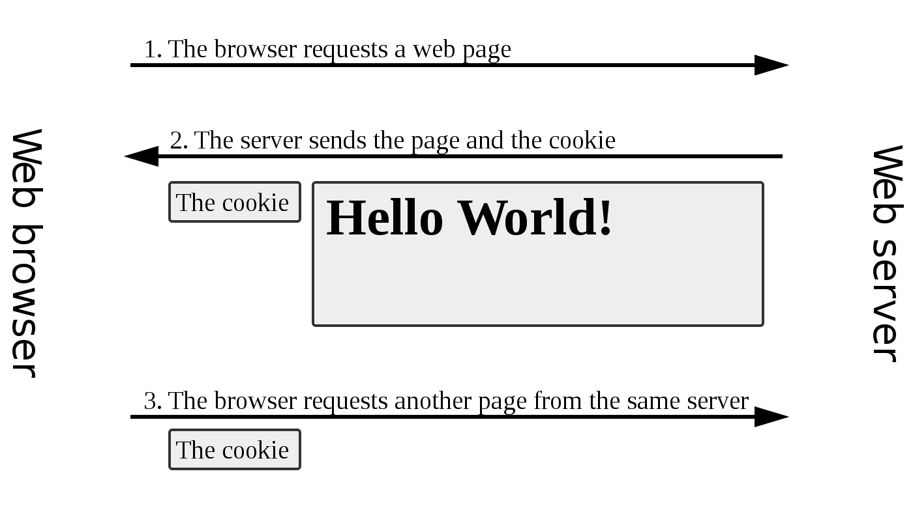
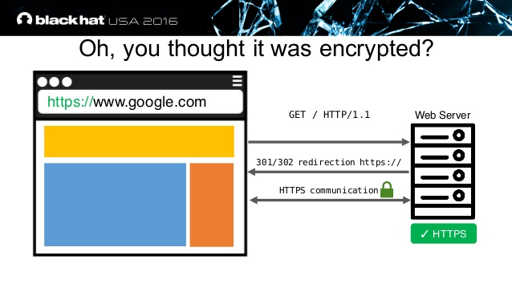
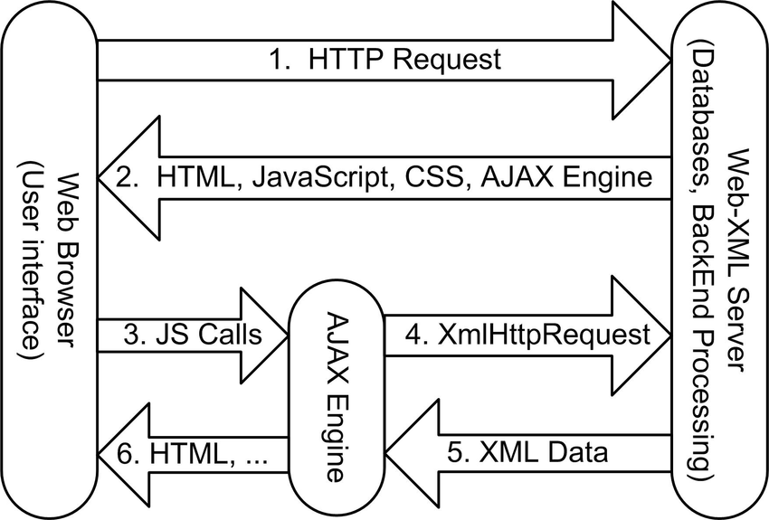

# 1. Today I Learned

## Modern_Web

---

Express Application 은 기본적으로 일련의 Middleware 함수 호출입니다.<br/>

## Express Middleware

* 등록된 순서대로 실행됩니다.

* 함수, 즉 안에서 어떤 작업이든 가능합니다.

* request 객체, response 객체, next 함수를 인자로 받습니다.

* request 객체, response 객체를 조작해서 기능 구현합니다.

* 다음 미들웨어를 동작시키기 위해 next 함수를 인자 없이 호출합니다.<br/>
  (호출을 안하면 해당 요청은 정지된 채로 방치됩니다.)<br/>

<br/><br/>

## Middleware 가 하는 일

* 모든 코드를 실행합니다.
* 요청 및 응답 오브젝트에 대한 변경을 실행합니다.
* 요청-응답 주기를 종료합니다.
* 스택 내의 그 다음 미들웨어를 호출합니다.

<br/><br/>

## Middleware 로 하는 일

* 로깅 (morgan)

* HTTP body 를 객체로 변환 (body-parser)

* 사용자 인증 (passport)

* 권한 관리 (express-stormpath)

```js
const secret = req.query.secret || req.body.secret;
if (secret !== process.env.SECRET) {
  res.status(403);
  res.send("403 Forbidden");
} else {
  next(); // 다음 미들 웨어로 과정을 넘긴다.
}
```

* ETC..

<br/><br/>

## 왜 Middleware 를 사용하는가?

미들웨어로 할 수 있는 모든 일은 라우트 핸들러에서도 할 수 있으나,<br/>
여러 라우터에서 사용해야 하는 기능을 중복 작성하는 불편을 덜고<br/>
코드를 재사용하기 위해 미들웨어를 사용하는 것입니다.<br/>

<br/><br/>

## Middleware 생태계

* 다양한 기능의 Middleware 들이 주로 모여있는 곳입니다.

> https://www.npmjs.com/search?q=express%20middleware&page=3&perPage=20

> https://expressjs.com/ko/resources/middleware.html

<br/><br/>

## 미들웨어 VS 라우트 핸들러

* 라우트 핸들러도 미들웨어입니다. (Express 의 거진 모든 것이 미들웨어)
* 즉, next 함수를 인자로 받는 것이 가능합니다.

```js
app.get("/", (req, res, next) => {
  if (!someCondition) {
    next(); // 요청을 처리를 하지 않고 다른 핸들러로 넘김
  } else {
    res.send("hello");
  }
});
```

<br/><br/>

## app.use

1.  미들웨어를 앱 전체에서 동작하도록 주입할 때

```js
app.use(helloMiddleware);
```

2.  특정 경로에서만 동작하도록 주입할 때

```js
app.use("/some-path", helloMiddleware);
```

3.  한 번에 여러 개 주입할 때

```js
app.use(middleware1, middleware2, middleware3, ...)
```

<br/><br/>

## Express 오류 처리

Express 는 내장된 오류 핸들러와 함께 제공되며, 내장 오류 핸들러는 앱에서 발생할 수 있는 모든 오류를 처리합니다.<br/>
이러한 기본 오류 처리 미들웨어 함수는 미들웨어 함수 스택의 끝에 추가됩니다.<br/>
<br/>

next()로 오류를 전달하지만 오류 핸들러에서 해당 오류를 처리하지 않는 경우,<br/>
기본 제공 오류 핸들러가 해당 오류를 처리하며, 해당 오류는 클라이언트에 스택 추적과 함께 기록됩니다.<br/>
스택 추적은 프로덕션 환경에 포함되어 있지 않습니다.<br/>
<br/>

응답의 기록을 시작한 후에 오류가 있는 next()를 호출하는 경우(예: 응답을 클라이언트로 스트리밍하는 중에 오류가 발생하는 경우),<br/>
Express 의 기본 오류 핸들러는 해당 연결을 닫고 해당 요청을 처리하지 않습니다.<br/>
<br/>

따라서 사용자 정의 오류 핸들러를 추가할 때,<br/>
헤더가 이미 클라이언트로 전송된 경우에는 다음과 같이 Express 내의 기본 오류 처리 메커니즘에 위임해야 합니다.<br/>

```js
function errorHandler(err, req, res, next) {
  if (res.headersSent) {
    return next(err);
  }
  res.status(500);
  res.render("error", { error: err });
}
```

<br/><br/>

## Cookie

쿠키는 클라이언트 로컬(웹 브라우저)에 저장되는 키와 값이 들어있는 작은 데이터 파일입니다.<br/>
쿠키에는 이름, 값, 만료날짜(쿠키 저장지간), 경로 정보, 접근 권한등 다양한 옵션이 들어있습니다.<br/>
쿠키는 일정시간동안 데이터를 저장할 수 있습니다. (로그인 상태 유지에 활용합니다.)<br/>
쿠키는 클라이언트의 상태 정보를 로컬에 저장했다가 참조합니다.<br/>

<br/><br/>

## 쿠키 전송 절차

1.  서버는 브라우저에 저장하고 싶은 정보를 응답과 같이 실어 보낸다 (Set-Cookie 헤더)

```http
HTTP/1.1 200 OK
Set-Cookie: cookieName=cookieValue; Secure; Max-Age=60000
...
```

2.  브라우저는 같은 서버에 요청이 일어날 때마다 해당 정보를 요청에 같이 실어서 서버에 보낸다 (Cookie 헤더)

```http
GET / HTTP/1.1
Cookie: cookieName=cookieValue; anotherName=anotherValue
...
```



<br/><br/>

## Set Cookie Option

* Expires, Max-Age : 쿠키의 지속 시간 설정을 할 수 있습니다.
* Secure : HTTPS 를 통해서만 쿠키가 전송되도록 설정할 수 있습니다.
  
* HttpOnly : 자바스크립트에서 쿠키를 읽지 못하도록 설정할 수 있습니다.
* Domain, Path : 쿠키의 scope 설정합니다. (쿠키가 전송되는 URL 을 제한합니다.)

<br/><br/>

## Express + Cookie

* 쿠키 읽기 - req.cookies

  요청에 실려온 쿠키가 객체로 변환되어 req.cookies 에 저장됩니다. (cookie-parser 미들웨어 필요합니다.)

* 쿠키 쓰기 - res.cookie(name, value)

  쿠키의 생성 혹은 수정합니다.

<br/><br/>

## JavaScript + Cookie

자바스크립트로도 쿠키를 읽고 쓰는 방법이 존재하지만,<br/>
보안 상 문제를 일으킬 수 있으므로 이런 접근 방식은 거의 사용되지 않는다.<br/>
<br/>

자바스크립트에서 쿠키에 접근하지 못하도록 HttpOnly 를 항상 설정하는 것이 제일 좋습니다.<br/>

<br/><br/>

## 쿠키의 한계점

* US-ASCII 밖에 저장하지 못합니다. 보통 percent encoding 을 사용합니다.<br/>
* 4000 바이트 내외(영문 4000 자, percent encoding 된 한글 444 자 가량)밖에 저장하지 못합니다.<br/>
* 브라우저에 저장됩니다. 즉, 여러 브라우저에 걸쳐 공유되어야 하는 정보,<br/>
  혹은 웹 브라우저가 아닌 클라이언트(모바일 앱)에 저장되어야 하는 정보를 다루기에는 부적절합니다.<br/>

<br/><br/>

## 웹개발 방식 - 알고가기

전통적 웹개발 방식 - 요청시마다 새로고침이 일어나며 페이지가 로딩될때마다 서버로부터<br/>
리소스들을 전달받아 해석한뒤 화면에 렌더링 하게 됩니다.<br/>

현대적 웹개발 방식 - 캐싱과 압축이라는 방식으로 어느정도 해소하였지만 결국 브라우저는<br/>
모든 CSS, 자바스크립트, HTML 을 해석한 뒤에 이들을 화면에 렌더링합니다.<br/>

<br/><br/>

## Ajax

비동기적인 웹 어플리케이션의 제작을 위한 클라이언트 측 웹 개발 기법이였으나<br/>
요즘에는 의미가 변형되어 웹 브라우저에서 XMLHttpRequest 혹은<br/>
fetch 를 이용해서 보내는 HTTP 요청을 통칭하기도 합니다.<br/>

<br/><br/>

## Ajax model



<br/><br/>

## Ajax 의 장점

* 화면 전체를 다시 로드하지 않고도 내용을 갱신할 수 있어 더 나은 사용자 경험 제공합니다.
* 서버의 응답을 기다리는 동안에도 여전히 웹 어플리케이션을 사용 가능합니다.
* 필요한 자원만 서버에서 받아오게 되므로 트래픽이 줄어듭니다.

<br/><br/>

## Ajax 의 단점

* 클라이언트 구현이 굉장히 복잡해졌습니다. (일이 복잡..)

<br/><br/>

## Axios

* Promise based HTTP client
* 브라우저와 Node.js 에서 모두 사용 가능합니다.
* XMLHttpRequest, fetch 에 비해 사용하기 편하고 기능이 더 많습니다.

<br/><br/>

## Axios Method

* patch : 자료의 일부내용만 변경하고 싶을 때 사용합니다.
* put : 자료 전체를 교체하고 싶을 때 사용합니다.
* post : post 방식의 전송을 할 수 있습니다.
* get : get 방식의 전송을 할 수 있습니다.

```js
// config 객체
axios
  .get("/api/todos", {
    params: {
      // query string
      title: "react 공부"
    },
    headers: {
      // 요청 헤더
      "X-Api-Key": "my-api-key"
    },
    timeout: 1000 // 1초 이내에 응답이 오지 않으면 에러로 간주
  })
  .then(res => {
    prettyPrint(res.data);
  });

//  axios 요청 메소드의 두 번째 인자로 config 객체를 넘길 수 있습니다.
// config 객체를 통해 요청의 쿼리 스트링, 요청 헤더, 쿠키 포함 여부 등 많은 것들을 설정할 수 있습니다.
```

* delete : 해당 자료를 삭제하고 싶을 때 사용합니다.

<br/><br/>

## Json-Server

아무 보안도 없고, 실무에서 사용하지 못하지만,<br/>
간단히 백엔드 기능이 필요할 때 사용하는 것이 좋습니다.<br/>

<br/>

* Plural routes (복수)

```
GET / posts;
GET / posts / 1;
POST / posts;
PUT / posts / 1;
PATCH / posts / 1;
DELETE / posts / 1;
```

* Singular routes (단수)

```
GET    /profile
POST   /profile
PUT    /profile
PATCH  /profile
GET    /profile
```

* Filter - Query String 을 이용해서 필요한 정보를 확인할 수 있습니다.

```
GET /posts?title=json-server&author=typicode
GET /posts?id=1&id=2

GET /comments?author.name=typicode
```

* Paginate - 페이지 별로 정보를 확인할 수 있습니다.<br/>
  \_page 를 사용하고 선택적으로 \_limit 을 사용하여 반환 된 데이터를 매김합니다.<br/>
  링크 헤더에서 첫 번째, 이전, 다음 및 마지막 링크를 얻을 수 있습니다.<br/>

```
GET /posts?_page=7
GET /posts?_page=7&_limit=20
```

기본적으로 10 개의 항목이 반환됩니다.<br/>

* Sort - `_sort`와 `_order`를 더해주면 정보를 정렬할 수 있습니다.<br/>
  기본값은 오름차순입니다.<br/>

```
GET /posts?_sort=views&_order=asc
GET /posts/1/comments?_sort=votes&_order=asc
```

여러 필드일 경우

```
GET /posts?_sort=user,views&_order=desc,asc
```

* Slice - `_start`와 `_end`,`_limit`을 더해주면 정보를 잘라서 볼 수 있습니다.<br/>
  X-Total-Count 헤더가 응답에 포함됩니다.<br/>

```
GET /posts?_start=20&_end=30
GET /posts/1/comments?_start=20&_end=30
GET /posts/1/comments?_start=20&_limit=10
```

Array.slice 와 똑같이 작동합니다 (예 : \_start 가 포함되고 \_end 만 포함).

* Operators - 범위를 가져 오기 위해 `_gte`,`_lte`를 추가하면 됩니다.

```
GET /posts?views_gte=10&views_lte=20
```

`_ne`를 사용하면 값을 배재합니다.

```
GET /posts?id_ne=1
```

`_like`를 사용하면 필터를 할 수 있습니다. (정규표현식도 지원합니다.)

```
GET /posts?title_like=server
```

* Full-text search - `q`를 더해주면 텍스트와 일치하는 정보를 검색할 수 있습니다.

```
GET /posts?q=internet
```

* Relationships - childeren 리소스를 포함하려면 `_embed`를 추가하면됩니다.

```
GET /posts?_embed=comments
GET /posts/1?_embed=comments
```

parent 리소스를 포함하려면 `_embed`를 추가하면됩니다.

```
GET /comments?_expand=post
GET /comments/1?_expand=post
```

중첩 된 리소스를 가져 오거나 만들려면 (기본적으로 한 수준에서는 추가 경로를 추가하십시오)

```
GET  /posts/1/comments
POST /posts/1/comments
```

<br/><br/>

## Json-Server Tip

```json
{
  "todos": [
    {
      "id": 1,
      /* json 서버에 들어가는 객체는 아이디는 다 적어주도록 하자 */
      "content": "할 일 텍스트",
      "complete": false
    }
  ]
}
```

<br/><br/>

# 2. Today I Found Out

```
한 주동안 백엔드 쪽에 대해서 공부를 해보았는데
처음은 어렵다가도 하나씩 차근차근 이해를 하려고 노력할수록
이해가 되어서 오늘 있었던 cookie, session, ajax, axios등..
크게 어렵지 않게 이해를 할 수 있었습니다.
하나하나 체인처럼 연결되어 있어 이해할수록 재미가 있습니다.
```

<br/><br/>

# 3. refer

> https://fds9.github.io/fds-nodejs-http/

> http://vuejs.kr/update/2017/01/04/http-request-with-axios/

> https://wpsn-axios-example.glitch.me/

> http://jeong-pro.tistory.com/80
