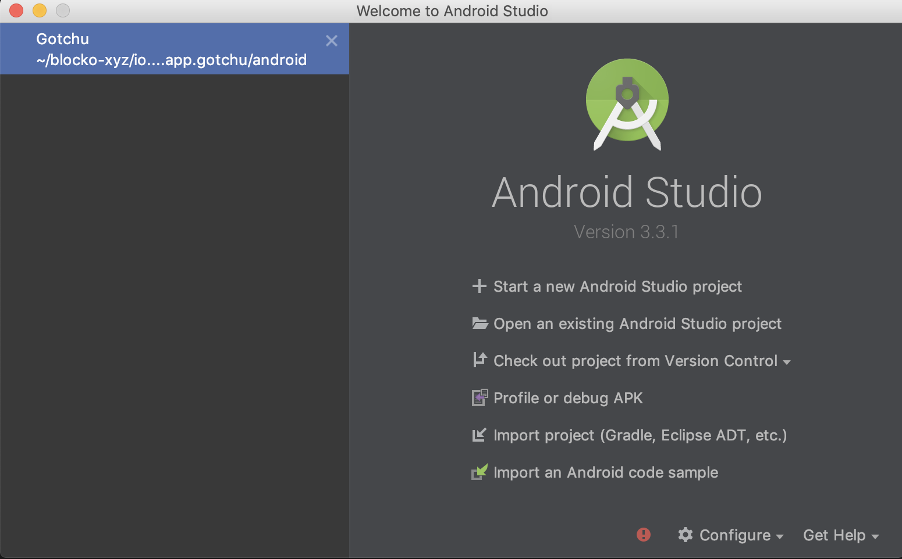
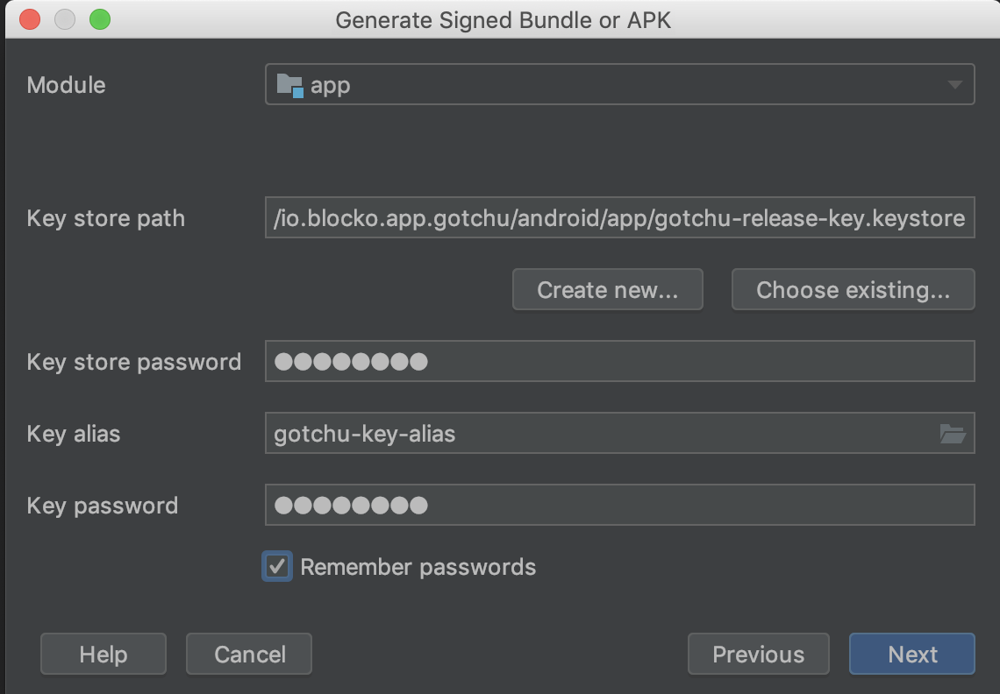

# APK 추출하기 - 굉장히 중요하기 때문에 2번 3번 확인하기!

## Android Studio 실행 및 프로젝트 선택

안드로이드 스튜디오를 켜고 해당하는 프로젝트를 선택한다.<br>
프로젝트가 없을 경우에는 react-native 소스코드가 있는 파일의 android 파일을<br>
안드로이드 스튜디오를 통해 열도록 한다.<br>
잘못 선택하지 않았는지 반드시 확인해야 한다.<br>
(2번 확인하자)<br>

<br>



<br>
<br>

## Assets 배포

```
react-native bundle --platform android --dev false --entry-file index.js --bundle-output android/app/src/main/assets/index.android.bundle --assets-dest android/app/src/main/res/
```

<br>
<br>

## APK를 Debug로 추출시!

VSCODE를 열어서 소스 코드의 `src/data/setting.json`의 debug가 false인지 먼저 확인한다.<br>
안드로이드 스튜디오의 Build Variants가 debug로 맞게 놓였는지 우선적으로 확인한다.<br>
메뉴 > Build > Build Bundle(s) / APK(s) > Build APK(s) 또는 Gradle > app > other > assembleDebug 실행<br>
빌드가 성공적으로 끝났으면 `android/app/build/output/apk/debug/app-debug.apk`가 있는지 확인한다.<br>
확인이 되었으면 `app-debug.apk`를 우클릭하여 reveal in finder를 선택해준다.<br>
명명규칙에 의거 `app-debug.apk`의 이름을 `Gotchu-DEV-VN1.0.0-VC6-연도월일-오늘몇번째로 만들었는지.apk`로 바꾸어준다.<br>
APK 디버그버전 추출 완료<br>
추출했다고 바로 전달하면 안된다! 반드시 자신의 핸드폰 및 시뮬레이터에 설치해보고<br>
google, facebook, email 로그인이 다 잘되는지 확인후 이상이없으면 QA테스터에게 전달해준다.<br>

<br>
<br>

## APK를 Release로 추출시!

VSCODE를 열어서 소스 코드의 `src/data/setting.json`의 debug가 false인지 먼저 확인한다.<br>
안드로이드 스튜디오의 Build Variants가 release로 맞게 놓였는지 우선적으로 확인한다.<br>
메뉴 > Build > Generate Signed APK > APK (bundle인지 apk인지 물어보는데 apk로 한다.) > <br>
기존에 설정된게 있어도 반드시 확인하면서 진행하도록 한다. > 추출<br>

기존에 설정된 것 이미지<br>



해당 값들은 `android/gradle.properties`에서 확인할 수 있다.

<br>
<br>

빌드가 진행되다 문제가 발생한다. 그러면 문제의 에러로그를 분명히 보고 비교해서 본다.<br>

에러가 Duplicate resources일 경우 Path를 비교해보고 왜 중복되었는지 확인을 한 후,<br>
다음과 같이 해주자. (빌드된 파일이 우선적이므로, android/app/src/main/res/drawable-\* 파일들을 지워야한다.)<br>

1. 루트 파일(android보다 한단계 상위인 폴더)에서 기존 리소스 삭제 `rm -rf android/app/src/main/res/drawable-*`
2. build > Clean Project 실행 후 Build > Generate Signed APK 또는 Gradle > app > other > assembleRelease 실행
3. 에러가 뜨는지 확인
4. 다음과 같은 에러가 뜰 경우 `android/app/src/main/res/raw/node_modules_iamportreactnative_src_html_certification.html`를 삭제해준다.

```
[raw/node_modules_iamportreactnative_src_html_certification] /Users/leekeunhwan/blocko-xyz/io.blocko.app.gotchu/android/app/src/main/res/raw/node_modules_iamportreactnative_src_html_certification.html
[raw/node_modules_iamportreactnative_src_html_certification] /Users/leekeunhwan/blocko-xyz/io.blocko.app.gotchu/android/app/build/generated/res/react/release/raw/node_modules_iamportreactnative_src_html_certification.html: Error: Duplicate resources
```

5. build > Clean Project 실행 후 Build > Generate Signed APK 또는 Gradle > app > other > assembleRelease 실행
6. 빌드가 성공적으로 끝났으면 `android/app/build/output/apk/release/app-release.apk`가 있는지 확인한다.

확인이 되었으면 `app-release.apk`를 우클릭하여 reveal in finder를 선택해준다.<br>
명명규칙에 의거 `app-release.apk`의 이름을 `Gotchu-LIVE-VN1.0.0-VC6-연도월일-오늘몇번째로 만들었는지.apk`로 바꾸어준다.<br>
APK 릴리즈버전 추출 완료<br>
추출했다고 바로 전달하면 안된다! 반드시 자신의 핸드폰 및 시뮬레이터에 설치해보고<br>
google, facebook, email 로그인이 다 잘되는지 확인후 이상이없으면 QA테스터에게 전달해준다.<br>
