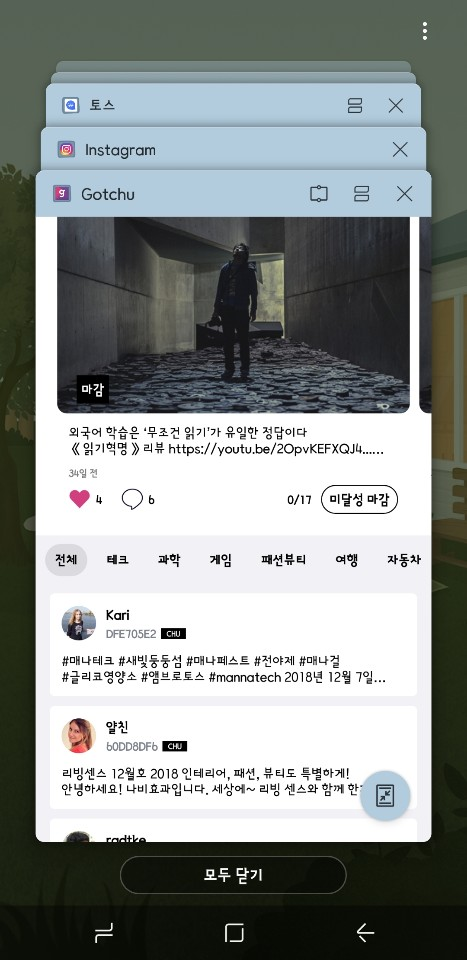

# Foreground와 Background

## Foreground와 Background는

앱이 살아있다는(실행후 종료되지 않은 상태) 부분은 같다. 
다만 상태에서 차이가 있다. 

 
 

## Foreground란?

현재 화면에 떠있는 상태를 의미한다. 
앱을 실행해서 이용하고 있는 도중, 작업관리자를 실행할 경우 
(아래이미지 - 보통 홈버튼 옆에 있어서 누르면 모두 닫기라는 창이뜨고 
메모리 관리 및 앱종료를 할 수 있는 그 기능을 의미) 

 

 

이 경우 Foreground는 실행하던 앱이 아닌 작업관리자다.
이처럼 단순히 화면에 실행되어 작동하고 있는 것을 Foreground라고 한다.

 
 

## Background란?

Foreground의 반대라고 보면된다. 
정확하게는 유저가 앱을 사용하지 않는 상태를 의미한다. 
홈버튼을 눌러서 앱을 백그라운드 상태로 두는 경우처럼 
이용하고 있진 않지만 앱이 살아있는(종료되지 않는) 상태이다. ㄴ

 
 

## Resume

Resume의 뜻은 이력서라는 의미도 있지만, 재개한다라는 의미도 있다. 
앱에서는 background에서 foreground로 앱이 재개되는 것을 resume이라고 한다. 

 

 

그림에서 Background에서 Foreground의 Inactive로 재개되는 그 과정을 resume이라고 한다. 
