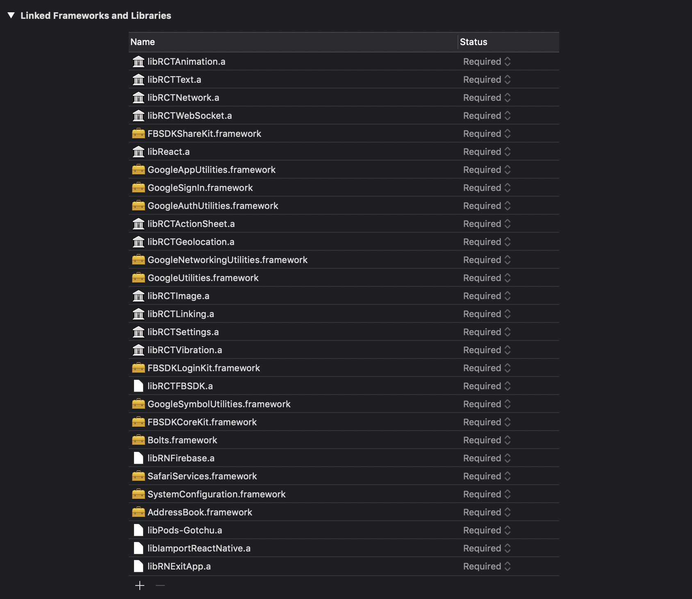

# iOS 아카이브 파일 만들기 & 테스트플라이트 배포

1. vscode의 `src/data/setting.json`에서 debug가 false인지, ENV가 DEV인지 LIVE인지 확인한다. 
   (테스트 플라이트에서는 DEV로 유지하고, 진짜 정식 릴리즈 단계에서 LIVE로 설정하도록 한다.) 

2. Xcode 실행

3. 프로젝트 선택 -> 반드시 Gotchu.xcworkspace로 열어야 한다.

4. command + shift + k (clean project)를 해준다.

5. window > organizer를 통해서 버젼과 빌드의 값을 보고 확인한다. 
   (작업환경이 달라질경우 기록이 없을 수 있다. -> 이 경우에는 이전 작업자에게 물어보고 정안될경우 app store connect에 들어가서 보는 방법으로..) 

6. 확인을 하였으면 general에서 version과 build의 값을 하나씩 올려준다. 
   (minor한 경우 맨 마지막 소수점 수의 값을 1 올려주고, major한 경우 맨 앞 혹은 가운데 숫자의 값을 1 올려준다.) 

7. 값을 올리고 난후 product > scheme > edit scheme에서 Build, Run, Test, Profile, Analyze, Archive를 모두 release로 바꿔준다.
   (live와 testflight 모두 release로 하도록 한다.)

8. linked framework and libraries에서 (libRCTAnimation.a, libRCTText.a, libRCTNetwork.a, libRCTWebSocket.a)를 삭제하도록 한다. 
   삭제버튼을 눌러도 화면이 변화가 안된다고 계속 누르면 지옥을 맛본다. 한번 누르고 삭제되었는지 화면을 다시 켜보거나 sourceTree를 통해 확인을 해보는것이 좋다. 
   (반대로 debug일 경우는 (libRCTAnimation.a, libRCTText.a, libRCTNetwork.a, libRCTWebSocket.a)를 추가해줘야 한다.) 

   다음 이미지는 삭제전 linked framework and libraries이다. 
   잘못지우면 이거보고 복구하도록.. (절대 그렇지 않도록 신중해야한다.) 

    
    

   

9. 삭제가 되었다면 다시 command + shift + k (clean project)를 해주고, Build Device를 `Generic iOS Device`로 변경해준다.

10. 여기까지 완료가 되면, product > archive를 실행해준다.

11. 아카이브 파일을 만드는 중인데, 지금까지의 절차를 잘 진행하였다면 빌드가 잘될 것이고, 아닌 경우에는 에러가 뜬다.

12. 아카이브 파일이 잘 완성이 되면 window > organizer의 화면이 뜬다.

13. 버젼과 빌드의 값을 잘 확인하고 문제가 없다면 Validate App (아카이빙 된 파일이 유효한지 테스트를 하는 것)을 실행하도록 한다.

14. Validate App을 클릭하면 옵션의 여부를 체크를 하는데 처음 두개의 체크리스트가 체크되어 나오는 창은 아무것도 건드리지말고 next를 누른다.

15. 두번째로 Auto로 할것인지 Manual로 할것인지 묻는데 우리는 Auto로 하게끔 되어있어서 Auto를 선택후 next를 눌러준다.

16. 회사와 유형등 확인하는 부분이 나오는데 회사는 Blocko.Inc가 맞는지 유형은 armv7 and arm64가 맞는지 확인하고 이상이 없으면 다음으로 넘어간다.

17. 유효성 검사를 한다. 유효성 검사가 문제없을 경우 성공적으로 끝났다는 화면이 나오고 다시 window > organizer의 화면으로 돌아온다.

18. Distibuted App을 누른다. 첫번째로 배포방식을 물어보는데 iOS App Store로 우리는 테스트플라이트와 라이브를 배포하기에 iOS App Store로 해준다. 
    (향후 다른 버젼을 사용해야한다면 목적에 맞게 변경가능하다. 근데 다른건 쓸일이 크게 없을듯하다.) 

19. 이후 물어보는 것에 대해서는 Validate App과 동일하게 하고 마지막으로 upload와 export를 선택하라고 하는데 upload로 해준다. (우리는 엔터프라이즈가 아니기 때문)

20. 이후 업로딩까지 자동으로 된다. 그러면 우리는 인터넷 브라우저를 키고 App store connect에 접속하도록 한다.

21. 로그인후 나의 앱을 선택하면 갓츄 앱 아이콘이 보인다. 클릭해준다.

22. 들어가면 TestFlight라고 선명히 보인다. 클릭해준다.

23. 해당 버전으로 올린 앱이 처리중(App Store Connect 사용자)인지 확인하고, 처리중일 경우 10여분 기다려준다.

24. 수출규정문수에 관련되어 누락사항이 있다고 나오는데 클릭한다.

25. 표준암호화에 대한 부분 = Y, 규정준수정보 = Y 를 선택후 다음으로 넘어오면 내부테스트시작이라는 버튼이 보인다. 눌러준다.

26. App Store Connect 사용자가 테스트중으로 바뀌면 이때부터 testFlight로 테스트가 가능하다.

27. iOS 기기의 기존 gotchu앱을 지우고 testflight앱에 들어가서 인스톨해준다.

28. google, facebook, email 로그인이 다 잘되는지 확인후 이상이없으면 QA테스터에게 전달해준다.
