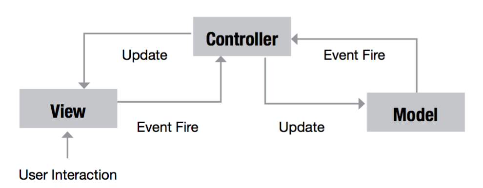

# React Study

## React 란 무엇인가?

---

React 는 프레임워크가 아닌 UI 라이브러리이다. 
여러 컴포넌트로 UI 를 구성하는 핵심 철학을 가지고 있다. 
React 는 템플릿 언어가 없는 순수한 JS 기반으로 컴포넌트 기반 아키텍처를 구현해냈다. 

 

## React 가 해결할 수 있는 문제는?

---

React 는 거대한 웹 어플리케이션의 데이터가 변경될 때마다 뷰를 직접 변경하고 관리하는 번거로움을 줄일 수 있다. 
또한 DOM 으로 렌더링하는 과정에서 병목현상이 일어나는 것을 피하기 위한 알고리즘을 만들어 내어, 
성능적으로나 속도면으로나 이득을 얻을 수 있다. 

 

## React 의 장점

---

* 단순한 앱 개발 : React 는 순수 CBA 로 선언형 스타일이며, 개발자 친화적인 강력한 DOM 추상화를 제공한다. 
  React-Native 를 사용하면 DOM 뿐만 아니라 Android 나 iOS 에서도 이런 이점을 얻을 수 있다. 

* 빠른 UI : React 는 뛰어난 선능을 제공한다. Virtual DOM 의 채택과 DOM 의 변경사항을 비교할 때 사용하는 알고리즘 덕분이다. 
  또한 헤드리스 브라우저를 사용하지 않고 테스트를 수행할 수 있다. 

* 코드량 감소 : React 커뮤니티와 개발 생태계를 통해 많은 라이브러리와 컴포넌트를 접할 수 있다. 
  직접 다 만들어서 사용할 필요가 없다. 이는 프레임워크를 선택할 때 중요한 부분이다. 

 

### 간결성

Keep it Small and Simple 
Keep it Short and Simple 

간결한 시스템이 더 잘 작동한다. 

React 는 뷰를 자동으로 갱신하는 선언형 스타일을 채택하였고, 
도메인 특정 언어를 사용하지 않으며, 강력한 추상화를 통해 DOM 의 쉬운 제어와 
크로스 브라우징을 위해 다르게 구현하던 인터페이스나 이벤트 핸들링을 정규화하였다. 

 

### 선언형 스타일 채택

선언형이란? 기존의 명령형과 달리 실행 결과가 어떻게 되어야 할지를 코드로 작성하는 것이다. 
(명령형 : 개발자가 순서대로 무엇을 해야 할지를 작성하는 것) 

React 는 상태 변경에 따라 뷰를 갱신하는 데 선언형 스타일이 빛을 발하는 순간이다. 

 

### 자바스크립트를 이용한 CBA

CBA 는 관심사 분리, 느슨한 결합, 코드 재사용등 이점이 많다. 

React 의 컴포넌트 클래스는 이런 CBA 를 구성하는 블록이다.  
그중에서도 코드 재상용이 쉬워서 코드를 줄일 수 있는 것이 대표적인 이점이다. 

 

### 강력한 추상화

React 는 강력한 문서 모델 추상화를 제공한다. 
내부의 인터페이스는 숨기고, 정규화 과정을 거친 합성 메서드와 속성을 제공한다. 
이러한 기능 덕분에 크로스 브라우징의 문제해결에 상당히 큰 도움을 준다. 
또한 서버 측 렌더링 기능이 가능하다. 
이는 SEO 와 성능 개선에 유용하다. 

 

### 속도와 테스트 용이성

불필요한 갱신이 발생하면 성능은 저하된다. 
동적인 UI 가 많을 경우 사용자 입장에서 최악이 될 수도 있다. 
반면에 React 는 Virtual DOM 을 통해 DOM 과 비교한 뒤 
변경사항만 갱신하기 때문에 이런 불필요한 갱신이 없으므로 
성능이 뛰어나다고 할 수 있다. 

또한 헤드리스 브라우저 없이도 테스트가 가능하다(Jest) 

 

### 폭넓은 개발 커뮤니티와 생태계

날마다 React 를 지지도가 높아지면서 개선 속도가 나날이 빨라지고, 
미래에 없어지면 어떡하지하는 걱정도 줄여준다. 
또한 개발 커뮤니티와 생태계에서 다양한 기능을 가진 
관련 라이브러리를 꾸준히 개발하고 있기에 생산성적인 측면에서도 
좋은 전망을 가진다고 볼 수 있다. 

 

## React 의 단점?

---

사람의 주관에 따라 장점 단점이 다를 수 있기에 참고만 하자

* 모든 기능을 갖춘 프레임워크가 아니다 (React 는 UI 라이브러리다.)

  * MVC 에서 V 에 해당되는 기술이기에 필요에 따라 없는 기능을 보완해줄 라이브러리를 같이 써야 할 수도 있다.

* JSX 와 Flux 의 생소함 - 초심자에게 어려울 수 있다.

  * (다른 템플릿언어에 비하면 쉬운 수준이니 걱정할 필요는 없다.)

* 단방향 데이터 바인딩 제공(1-way data binding)

  * 단방향 바인딩은 복잡한 앱에서 복잡도를 줄이는 데 도움을 준다.
  * 하지만 양방향 바인딩에 익숙한 분들에게는 조금 불편할 수 있다.

* 리액티브 프로그래밍이라고 볼 수 없다.
  * 리액티브 프로그래밍이나 아키텍처는 이보다 더 이벤트 기반이고, 탄력성과 반응성이 뛰어나다.
  * 비동기 데이터 스트림을 다루려면 RxJS 같은 도구를 사용해야 한다.

 

[!!프론트엔드의 MVC 란?!!]
-> MVC(모델-뷰-컨트롤러)는 소프트웨어를 만든는 아키텍쳐 패턴으로 어플리케이션의 UI 를 세가지로 나누어 기능에 따라 
코드 베이스를 정리하여 정보를 논리적으로 표시하게 돕는 역할을 한다. 

* M (모델) : 어플리케이션에 사용되는 데이터의 일반적인 포맷이다. (비즈니스 규칙, 유효성 검사 로직등.. 기능을 포함할 수 있다.) 
* V (뷰) : 사용자에게 데이터를 나타낸다. 다수의 뷰는 같은 모델 데이터를 다양하게 표시할 수 있다. ((ex) 차트와 그리드) 
* C (컨트롤러) : MVC 의 핵심적인 부분으로 어플리케이션의 이벤트를 리스닝해 모델과 뷰 사이의 명령을 위임한다. 

 

[!! 리액티브 프로그래밍이란 ? !!] 
-> 비동기 프로그래밍의 일부이며 실행 스레드가 제어 흐름을 주도하는 것이 아닌 새로운 정보가 로직을 주도하는 패러다임이다. 
(함수형 리액티브 프로그래밍이랑 착각하면 안된다.) 

 

## 웹 어플리케이션에 React 를 적용하는 방법

1.  UI 라이브러리로 React 와 관련된 Redux 나 React Router 를 활용한 당일 페이지 어플리케이션 스택의 구성
2.  MVC 의 V 를 대체하는 UI 라이브러리로 기존 MVC 프레임워크와의 결합
3.  jQuery 를 기반으로 서버 측 렌더링을 거친 어플리케이션에서 자동완성 등 일부 기능을 위한 UI 컴포넌트로 활용
4.  대부분의 로직을 직접 처리하는 전통적인 방식의 백엔드에서 서버 측 렌더링 템플릿 라이브러리로 활용
5.  백엔드와 프론트엔드에서 모두 자바스크립트를 사용하는 경우 ((ex) Meteor.js, Express.js)
6.  React Native 를 UI 라이브러리로 사용한 모바일 앱
7.  여러 가지 렌더링 대상에 적용할 목적으로 사용하는 UI 라이브러리

이중에서 1 번이 인기가 제일 좋다.

 
