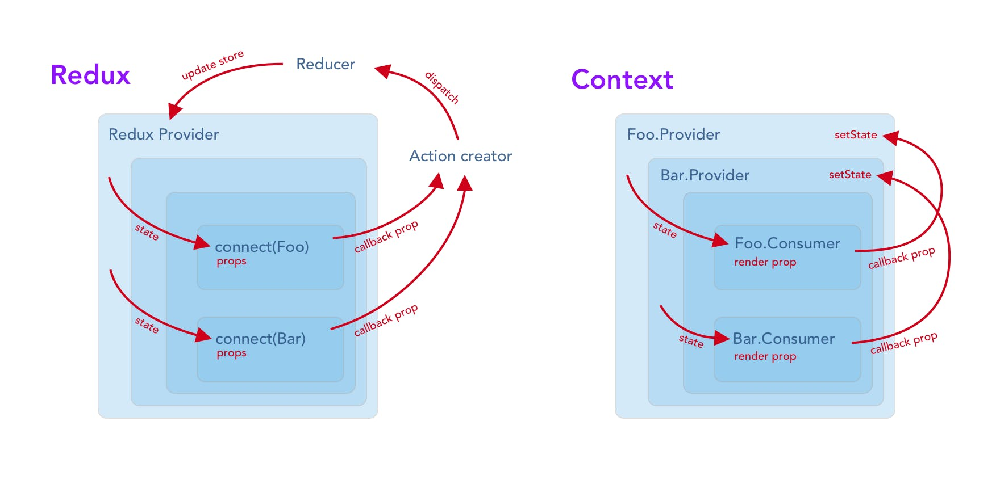

# Today I Learned (2018.07.02)

## Redux

Redux 는 Context API 를 쓰기 이전에 상태를 관리하고 외부세계와의 연결을 담당하기 위해 쓰이던 라이브러리입니다.<br>
얼핏보기에는 Redux 가 Context API 와 비슷해보이지만 단 하나의 객체에 모든 것이 저장되어 관리되고 HOC 를 통해 값을 내려주는 것이 다릅니다.<br>

---

## Context API 와 Redux 의 차이점

| Context API                                     | Redux                                                                      |
| ----------------------------------------------- | -------------------------------------------------------------------------- |
| (주로) 상태가 컴포넌트 state 에 저장됨          | 상태가 외부 스토어에 저장됨                                                |
| `Provider` & `Consumer` 를 사용해 값을 내려보냄 | `connect` HOC 를 사용해 값을 내려보냄                                      |
| (주로) 객체지향 프로그래밍 스타일               | (주로) 함수형 프로그래밍 스타일                                            |
| React 컴포넌트의 기능 외에는 활용할 수 없음     | 다수의 미들웨어 라이브러리 및 개발도구를 통해 손쉽게 기능을 확장할 수 있음 |
| React 16.3 버전 이상에서만 지원됨               | React 버전에 상관없이 사용할 수 있음                                       |



<br>

## Redux - 액션

액션은 애플리케이션에서 스토어로 보내는 데이터 묶음입니다.<br>
이들이 스토어의 유일한 정보원이 됩니다. `store.dispatch()`를 통해 이들을 보낼 수 있습니다.<br>

```js
const ADD_TODO = "ADD_TODO";
```

```js
{
  type: ADD_TODO,
  text: 'Build my first Redux app'
}
```

액션은 평범한 자바스크립트 객체입니다.<br>
액션은 반드시 어떤 형태의 액션이 실행될지 나타내는 type 속성을 가져야 합니다.<br>
타입은 일반적으로 문자열 상수로 정의됩니다. 앱이 충분히 커지면 타입들을 별도의 모듈로 분리할수도 있습니다.<br>

```js
import { ADD_TODO, REMOVE_TODO } from "../actionTypes";
```

type 외에 액션 객체의 구조는 마음대로입니다.<br>
사용자가 할일을 완료했다고 체크하는 액션 하나를 더 추가합시다.<br>
할일은 배열 안에 저장되기 때문에 우리는 특정한 할일을 index 를 통해 참조할 수 있습니다.<br>
진짜 앱에서는 새 할일이 만들어질때마다 유일한 ID 를 부여하는게 더 좋겠죠.<br>

```js
{
  type: COMPLETE_TODO,
  index: 5
}
```

각 액션에는 가능한 적은 데이터를 전달하는 것이 좋습니다.<br>
예를 들어, 할일 객체 전체를 전달하는 것 보다는 index 를 전달하는 것이 낫습니다.<br>
마지막으로, 지금 보이는 할일들을 바꾸는 액션을 추가하겠습니다.<br>

```js
{
  type: SET_VISIBILITY_FILTER,
  filter: SHOW_COMPLETED
}
```

<br>

## Redux - 액션 생산자

액션 생산자는 액션을 만드는 함수입니다.<br>
"액션"과 "액션 생산자"는 혼용하기 쉬운 용어이니 적절하게 사용하도록 신경써야 합니다.<br>
전통적인 Flux 구현에서 액션 생산자는 보통 불러와졌을때 액션을 보냅니다.<br>

```js
function addTodoWithDispatch(text) {
  const action = {
    type: ADD_TODO,
    text
  };
  dispatch(action);
}
```

이와는 대비되게 Redux 의 액션 생산자는 단지 액션을 반환합니다<br>

```js
function addTodo(text) {
  return {
    type: ADD_TODO,
    text
  };
}
```

이는 액션 생산자를 더 이식하기 좋고 테스트하기 쉽게 합니다.<br>
실제로 액션을 보내려면 결과값을 dispatch() 함수에 넘깁니다<br>

```js
dispatch(addTodo(text));
dispatch(completeTodo(index));
```

아니면 자동으로 액션을 보내주는 바인드된 액션 생산자를 만듭니다<br>

```js
const boundAddTodo = text => dispatch(addTodo(text));
const boundCompleteTodo = index => dispatch(completeTodo(index));
```

이들은 바로 호출할 수 있습니다<br>

```js
boundAddTodo(text);
boundCompleteTodo(index);
```

dispatch() 함수를 스토어에서 store.dispatch()로 바로 접근할 수 있지만,<br>
보통 react-redux 의 connect()와 같은 헬퍼를 통해 접근할 것입니다.<br>
여러 액션 생산자를 dispatch()에 바인드하기 위해 bindActionCreators()를 사용할수도 있습니다.<br>

<br>

## Redux - Source Code - Action.js

```js
/*
 * 액션 타입
 */

export const ADD_TODO = "ADD_TODO";
export const COMPLETE_TODO = "COMPLETE_TODO";
export const SET_VISIBILITY_FILTER = "SET_VISIBILITY_FILTER";

/*
 * 다른 상수
 */

export const VisibilityFilters = {
  SHOW_ALL: "SHOW_ALL",
  SHOW_COMPLETED: "SHOW_COMPLETED",
  SHOW_ACTIVE: "SHOW_ACTIVE"
};

/*
 * 액션 생산자
 */

// typex이라는 속성은 항상 있어야 합니다. - Convention
export function addTodo(text) {
  return { type: ADD_TODO, text };
}

export function completeTodo(index) {
  return { type: COMPLETE_TODO, index };
}

export function setVisibilityFilter(filter) {
  return { type: SET_VISIBILITY_FILTER, filter };
}
```

<br>

## Redux - 리듀서

액션은 무언가 일어난다는 사실을 기술하지만,
그 결과 애플리케이션의 상태가 어떻게 바뀌는지는 특정하지 않습니다.
이것은 리듀서가 할 일이죠.

<br>

## Redux - 액션 다루기

리듀서를 작성해봅시다.
리듀서는 이전 상태와 액션을 받아서 다음 상태를 반환하는 순수 함수입니다.

```js
(previousState, action) => newState;
```

이 형태의 함수를 Array.prototype.reduce(reducer, ?initialValue)로 넘길 것이기 때문에 리듀서라고 부릅니다.<br>
리듀서를 순수하게 유지하는것은 매우 중요합니다.<br>
절대로 리듀서 내에서 하지 말아야 할 것들은<br>

- 인수들을 변경(mutate)하기
- API 호출이나 라우팅 전환같은 사이드이펙트를 일으키기
- Date.now()나 Math.random() 같이 순수하지 않은 함수를 호출하기.

사이드이펙트를 어떻게 일으키는지는 심화과정에서 확인하게 될겁니다. <br>
지금은 리듀서가 반드시 순수해야 한다는 점만 기억해두세요.<br>
인수가 주어지면, 다음 상태를 계산해서 반환하면 됩니다. 예기치 못한 일은 없어야 합니다.<br>
사이드 이펙트도 없어야 합니다. API 호출도 안됩니다. 변경도 안됩니다. 계산만 가능합니다.<br>

이 정도로 해두고, 우리가 전에 정의했던 actions 을 이해하도록 천천히 리듀서를 작성해봅시다.<br>

초기 상태를 정하는데서 시작하겠습니다. Redux 는 처음에 리듀서를 undefined 상태로 호출합니다.<br>
그때가 초기 상태를 반환할 기회입니다<br>

```js
import { VisibilityFilters } from "./actions";

const initialState = {
  visibilityFilter: VisibilityFilters.SHOW_ALL,
  todos: []
};

function todoApp(state, action) {
  if (typeof state === "undefined") {
    return initialState;
  }

  // 지금은 아무 액션도 다루지 않고
  // 주어진 상태를 그대로 반환합니다.
  return state;
}
```

더 간단하게 작성하는 방법은 ES6 default arguments 문법을 사용하는 것입니다

```js
function todoApp(state = initialState, action) {
  // 지금은 아무 액션도 다루지 않고
  // 주어진 상태를 그대로 반환합니다.
  return state;
}
```

이제 SET_VISIBILITY_FILTER 를 처리합시다. 우리가 할 일은 상태에서 visibilityFilter 를 바꾸는 것 뿐입니다.

```js
function todoApp(state = initialState, action) {
  switch (action.type) {
    case SET_VISIBILITY_FILTER:
      return Object.assign({}, state, {
        visibilityFilter: action.filter
      });
    default:
      return state;
  }
}
```

짚고 넘어갈 점은:

1.  우리는 state 를 변경하지 않았습니다. Object.assign()을 통해 복사본을 만들었죠.<br>
    Object.assign(state, { visibilityFilter: action.filter })이라고 써도 여전히 틀립니다.<br>
    첫번째 인수를 변경하게 되니까요. 여러분은 반드시 첫번째 인수로 빈 객체를 전달해야 합니다.<br>
    ES7 로 제안된 object spread syntax 을 써서 { ...state, ...newState }로 작성할수도 있습니다.<br>

2.  default 케이스에 대해 이전의 state 를 반환했습니다. 알 수 없는 액션에 대해서는 이전의 state 를 반환하는것이 중요합니다.

<br>

## Redux - 더 많은 액션 다루기

다룰 액션이 2 개 더 있습니다! 리듀서가 ADD_TODO 를 다룰 수 있도록 확장합시다.

```js
function todoApp(state = initialState, action) {
  switch (action.type) {
    case SET_VISIBILITY_FILTER:
      return Object.assign({}, state, {
        visibilityFilter: action.filter
      });
    case ADD_TODO:
      return Object.assign({}, state, {
        todos: [
          ...state.todos,
          {
            text: action.text,
            completed: false
          }
        ]
      });
    default:
      return state;
  }
}
```

앞에서와 마찬가지로 state 나 그 필드들을 직접 쓰는 대신 새 객체를 반환했습니다.<br>
새 todos 는 이전의 todos 의 끝에 새로운 할일 하나를 붙인 것과 동일합니다.<br>
새로운 할일은 액션의 데이터를 이용해서 만들어졌습니다.<br>

마지막으로, COMPLETE_TODO 핸들러를 구현합시다.<br>

```js
case COMPLETE_TODO:
  return Object.assign({}, state, {
    todos: [
      ...state.todos.slice(0, action.index),
      Object.assign({}, state.todos[action.index], {
        completed: true
      }),
      ...state.todos.slice(action.index + 1)
    ]
  });
```

변경 없이 배열의 특정 할일만 수정하고 싶기 때문에, 그 할일의 앞과 뒤를 잘라냈습니다.<br>
만약 이런 코드를 자주 작성해야 한다면 React.addons.update, updeep 같은 헬퍼나<br>
Immutable 같이 깊은 수정을 지원하는 라이브러리를 사용하는것이 좋습니다.<br>
state 를 복사하기 전엔 그 안의 무엇에도 할당하지 말아야 한다는걸 기억하세요.<br>

[js 로 만들어본 리듀서]

```js
// 액션: 상태를 어떻게 변형시킬지 나타내는 *객체*.
// `type`이라는 속성을 가지고 있어야 합니다.

// 액션 타입

const INCR = "INCR";
const ZERO = "ZERO";
const ADD_TODO = "ADD_TODO";

// 액션 생산자

function incr(amount) {
  return {
    type: INCR,
    amount
  };
}

function zero() {
  return {
    type: ZERO
  };
}

function addToDo(body) {
  return {
    type: ADD_TODO,
    body
  };
}

// 리듀서
// 상태와 액션을 인수로 받아서, 다음 상태를 반환하는 *순수 함수*
// 리듀서의 매개변수에 상태의 기본값을 줘야하는 것이 관례입니다.

// reducer 쪼개기 #1
// rootReducer의 역할 분리 - count
function count(state = 0, action) {
  switch (action.type) {
    case INCR:
      return state + action.amount;
    case ZERO:
      return 0;
    default:
      return state;
  }
}

// reducer 쪼개기 #2
// rootReducer의 역할 분리 - todos
function todos(state = [], action) {
  switch (action.type) {
    case ADD_TODO:
      return [
        ...state,
        {
          body: action.body,
          complete: false
        }
      ];
    default:
      return state;
  }
}

// 리듀서를 만들 때 초기 state 값을 적는 것이 관례입니다.
const initialState = {
  count: 0,
  todos: []
};

// redux store는 초기 상태를 만들 때
// state에 undefined,
// action에 빈 객체를 넣어 리듀서를 호출합니다.
function rootReducer(state = initialState, action) {
  switch (action.type) {
    case INCR:
    case ZERO:
      return {
        ...state,
        count: count(state.count, action)
      };

    case ADD_TODO:
      return {
        ...state,
        todos: todos(state.todos, action)
      };

    default:
      // default를 적어주는 것 또한 관례입니다.
      return state;
  }
}

// 리덕스를 이용하면 쉽게 위의 rootReducer와 리듀서를 만들 수 있습니다.
// combineReducers는 작은 Reducer를 합쳐주는 유틸리티 함수입니다.
const rootReducer = combineReducers({
  todos,
  count
});

// createStore라는 함수를 써서 쉽게 store 객체로 만들 수 있습니다.
const store = createStore(rootReducer);

// store 객체에서 subscribe라는 리스너 함수를 이용하면
// 손쉽게 변화되는 것을 console로 확인할 수 있습니다.
store.subscribe(() => {
  console.log(store.getState());
});

// React와 Redux의 연결
// store - subscribe - setState
// dispatch한 것을 subscribe하여 this.setState로 화면을 다시 그리는 것 상상해보기
```

<br>

## Redux - 스토어

이전 섹션에서 우리는 "무엇이 일어날지"를 나타내는 액션과 이 액션에 따라 상태를 수정하는 리듀서를 정의했습니다.<br>
<b style="color:salmon">스토어는 이들을 함께 가져오는 객체</b>입니다. 스토어는 아래와 같은 일들을 해야 합니다<br>

- 애플리케이션의 상태를 저장하고
- `getState()`를 통해 상태에 접근하게 하고
- `dispatch(action)`를 통해 상태를 수정할 수 있게 하고
- `subscribe(listener)`를 통해 리스너를 등록합니다.

Redux 애플리케이션에서 단 하나의 스토어만 가질 수 있음을 알아두는것이 중요합니다.<br>
만약 데이터를 다루는 로직을 쪼개고 싶다면, 여러개의 스토어 대신 리듀서 조합을 사용할 수 있습니다.<br>

리듀서를 만들었다면 스토어를 만드는건 쉽습니다.<br>
이전 섹션에서 우리는 combineReducers()를 통해 여러 리듀서를 하나로 합쳤습니다.<br>
우리는 이것을 가져와서 createStore()에 넘길겁니다.<br>

```js
import { createStore } from "redux";
import todoApp from "./reducers";

let store = createStore(todoApp);
```

createStore()의 두번째 인수로 초기 상태를 지정해줄수도 있습니다.<br>
이는 서버에서 실행중인 Redux 애플리케이션의 상태와 일치하도록 클라이언트의 상태를 채워줄때 유용합니다.<br>

```js
let store = createStore(todoApp, window.STATE_FROM_SERVER);
```

<br>

## Redux - React 와 연결하기

[container Component 만들기]

```js
// connect라는 컴포넌트가 container Component를 만들어 줍니다.
import { connect } from "react-redux";

const VisibleTodoList = connect(
  mapStateToProps,
  mapDispatchToProps
)(TodoList);

export default VisibleTodoList;
```
