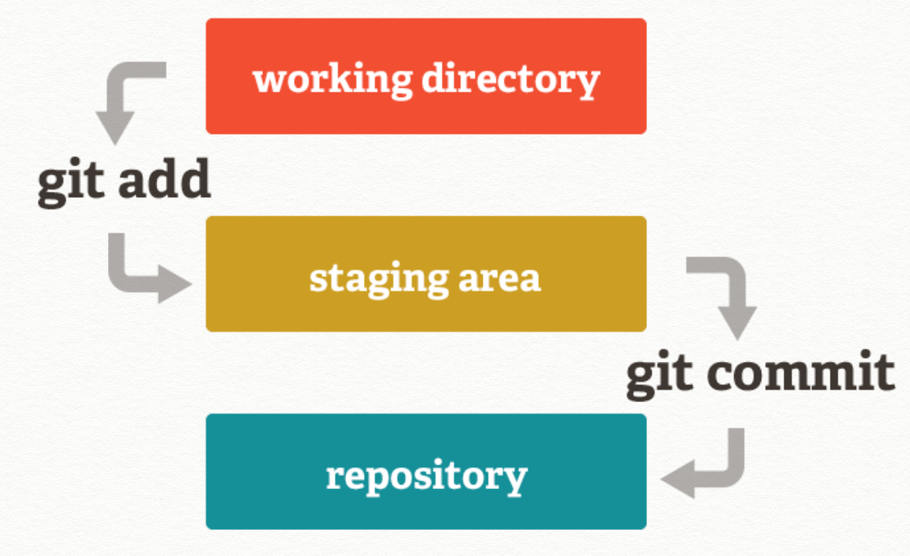
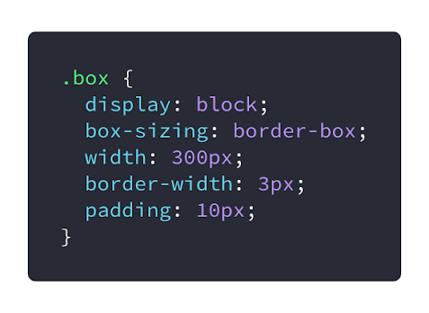
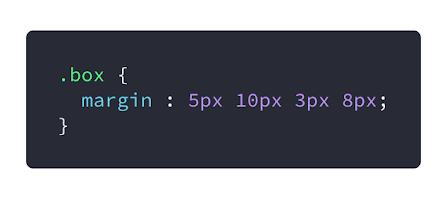
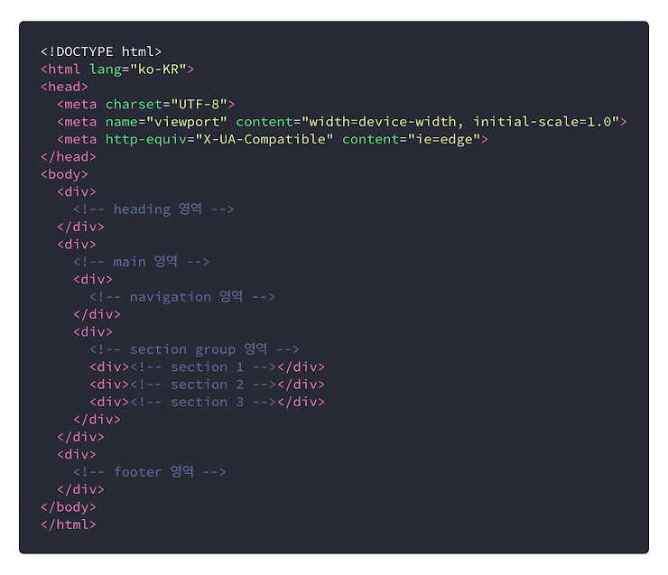
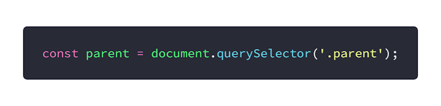
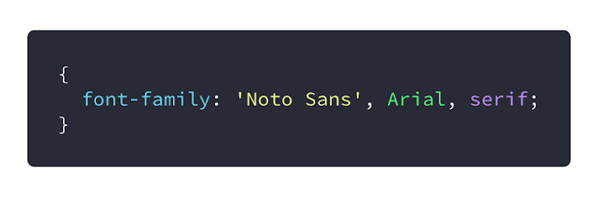

# 1. Today I Learned (중간테스트 준비 및 지금까지의 배운 것 복습)

## Markdown 은 HTML 로 쉽게 변환이 될 수 있다?

> 정답 : O

Markdown 은 마크업 언어의 일종으로 HTML 로 쉽게 변환될 수 있으며, 간결하고, 별도의 도구 없이 작성이 가능합니다.<br/>

<br/>

## Github 은 Markdown 문법을 양식에 맞게 렌더링하는 기능을 제공한다?

> 정답 : O

Github 에서는 Markdown 문법을 양식에 맞게 제공합니다.<br/>
또한 폴더를 생성하면 README.md 라는 마크다운문서로 사용법 혹은 주의사항, 개발현황등<br/>
사람들이 이해하기 쉽게 문서를 작성할 것을 권해줍니다.<br/>

<br/>

## Git 을 사용하면 시간에 따른 작업 내역을 확인할 수 있다?

> 정답 : O

Git 은 버전 관리 시스템(VCS)으로 시간에 따른 코드의 변화를 체계적으로 관리해줍니다.<br/>
소스코드가 언제, 누가, 어떻게, 왜 바꾸었는지 정보를 관리합니다.<br/>

<br/>

버전 관리 시스템을 사용하면 좋은 점<br/>

* 시간의 흐름에 따른 작업 내역을 확인할 수 있음
* 이전 버전으로 쉽게 돌아갈 수 있음
* 다른 사람들에게 영향을 미치지 않고 코드를 변경해볼 수 있음
* 소스코드의 특정 부분을 누가 언제 변경했는지 쉽게 확인할 수 있음
* 실수로 파일을 삭제하더라도 쉽게 복구할 수 있음

<br/>

## '작업 디렉터리'는 저장소에 저장할 변경 사항을 보관하는 임시 저장소를 의미한다?

> 정답 : X



* 작업 디렉토리 (Working directory) - 현재 편집 중인 파일이 저장되는 영역
* 스테이징 영역 (Staging area) - 저장소에 저장할 변경 사항을 보관하는 임시 저장소
* .git 디렉터리 (Repository) - 모든 작업 내역이 영구히 저장되는 저장소

<br/>
작업의 흐름<br/>

1.  git init - 저장소 생성
2.  소스코드 편집
3.  git add `file` - 작업 디렉토리의 특정 변경 사항을 스테이징 영역에 등록
4.  git commit -m "메시지내용" - 스테이징 영역에 올라온 변경사항을 영구히 보관

<br/>

## Git 저장소에 커밋을 할 때, 변경한 파일의 전체 내용이 저장된다?

> 정답 : X

커밋을 하기전 add 를 하게 되는데 그때 특정 변경 사항이 스테이징 영역에 등록이 되고,<br/>
커밋을 하게되면 스테이징 영역에 올라온 특정 변경 사항이 영구히 보관됩니다.<br/>
전체 내용이 저장되는 것은 아닙니다.<br/>

<br/>

## 컴퓨터는 전기로 제어할 수 있는 스위치(릴레이, 진공관, 트랜지스터 등)를 이용해 정보를 처리한다?

> 정답 : O

컴퓨터는 전기를 이용하여 꺼진 상태(0), 켜진 상태(1)를 나타낼 수 있습니다.<br/>
이러한 정보를 가지고 수와 문자등 다양한 연산처리를 처리합니다.<br/>

<br/>

## 십진수 20 을 이진법으로 고쳐 쓰면 10010 이다?

> 정답 : X

이진수인 10010 은 2^4 + 2^1 이므로 18 이 됩니다.<br/>
십진수로 20 을 2 진법으로 고쳐쓰게 될 경우 20 = 2^4 + 2^2 이므로 10100 이 되어야 합니다.<br/>

<br/>

## 1 킬로바이트는 8000 비트를 의미한다?

> 정답 : O

1byte = 8bit 입니다.<br/>
1kb = 1000byte 이므로 1kb = 8000bit 가 됩니다.<br/>
(kb 와 Kib 와 혼동하면 안됩니다. kb = 1000byte, Kib = 1024byte)<br/>

<br/>

## console.log(1 + 2 \* 3); 의 출력 결과는 9 이다?

> 정답 : X

연산자 우선순위에 따라서 2*3 이 먼저 계산되고 1+6(2*3 의 연산 결과값)이 계산되므로 7 이 출력됩니다.<br/>

<br/>

## console.log(true || false); 의 출력 결과는 true 이다?

> 정답 : O

true || false 는 둘 중 하나만 참이여도 true 를 반환합니다.<br/>
OR(||)은 논리합이기에 0+1 을 했을 경우 1(값이있음 = true)이 결과이므로 true 가 됩니다.<br/>
반면에 AND(&&)는 논리곱이므로 둘다 true 가 아닌 경우 false 를 반환합니다.<br/>
1 \* 0 은 0(값이 없음 = false) 이기 때문입니다.<br/>

<br/>

## 주 기억 장치에 있던 프로그램이 실행되면 보조 기억 장치에 적재된다?

> 정답 : X

보조 기억 장치는 실행 중이 아닌 프로그램 및 데이터가 저장되는 장치입니다.(우리가 아는 HDD, SSD..)<br/>
실행 중이 아닌 프로그램이 실행되면 보조 기억 장치에서 주 기억 장치인 메인 메모리(RAM)로 탑재가 됩니다.<br/>

<br/>

## 입력 장치에는 마우스, 키보드 같은 것들이 있고, 출력 장치에는 모니터, 프린터 같은 것들이 있다?

> 정답 : O

입력 장치는 데이터를 입력할 수 있는 장치들을 말하고 출력 장치는 정보를 출력하는 장치를 의미합니다.<br/>
<br/>
입력 장치 : 마우스, 키보드, 스캐너, 조이스틱, 웹캠등..<br/>
출력 장치 : 모니터, 프린터, 스피커, 플로터, 천공카드등..<br/>

<br/>

## 64 비트 컴퓨터는 32 비트 컴퓨터에 비해 두 배 빠르다?

> 정답 : X

64 비트, 32 비트 라는건 쉽게 말해 컴퓨터의 연산속도를 얘기합니다.<br/>
여기서 비트앞에 있는 숫자는 단순히 비트의 수가 아닌 2 의 제곱을 가리키는 수입니다.<br/>
즉, 2^64 와 2^32 의 차이인 것입니다.<br/>
2 배 빠른 정도가 아니라 엄척 큰 차이라고 볼 수 있습니다. (대략 4294967296 배 차이 납니다.)<br/>

<br/>

## CPU 가 실행시킬 수 있는 기계어의 집합을 명령어 세트(instruction set)라고 한다?

> 정답 : O

기계어란 CPU 에 의해 직접 실행될 수 있는 언어를 의미하며,<br/>
CPU 와 메모리를 어떻게 조작할 것인가를 표현합니다.<br/>
CPU 의 종류에 따라 사용할 수 있는 기계어가 정해져 있고, 이런 기계어의 집합을 명령어 세트라고 합니다.<br/>

<br/>

## 기계어로 작성되지 않은 프로그램도 CPU 를 통해 바로 실행될 수 있다?

> 정답 : X

기계어로 작성된 프로그램은 바로 실행이 가능하나 기계어로 작성되진 않은 프로그램은 적절한 변환 과정을 거쳐야 합니다.<br/>
그래서 우리가 작성하는 JS 및 기타 다른 프로그래밍언어들을 실행시키기 위해서 컴퓨터가 이해할 수 있도록 하기 위해<br/>
컴파일러(언어를 기계어로 변환해주는 프로그램)와 인터프리터(언어를 해석한 후 간접적으로 실행시켜주는 프로그램)가 필요합니다.<br/>

<br/>

## 운영체제는 하드웨어를 관리하는 프로그램으로, 여러 프로그램이 자원을 공유하는데 문제가 없도록 중재하는 역할을 한다?

> 정답 : O

운영체제는 하드웨어를 관리하는 프로그램으로 여러 프로그램이 한정된 자원(CPU, 메모리, 입출력 장치)을 공유하는데 문제가 없도록 중재합니다.<br/>
또한 다른 프로그램이 컴퓨터 자원을 활용할 수 있도록 API 를 제공합니다.<br/>

<br/>

## Linux 와 macOS 는 모두 유사-유닉스(Unix-like) 운영체제로, 서로 비슷한 쉘 명령어를 지원한다?

> 정답 : O

Linux 와 macOS 모두 unix 에서 파생되었기 때문에 서로 비슷한 쉡 명령어를 지원합니다.<br/>

<br/>

## 3 === 3 의 결과값은 true 이다?

> 정답 : O

=== 연산자는 값과 타입 모두 동일해야만 true 를 반환합니다.<br/>
둘 다 3 이라는 값이 같고, 타입 또한 number 이기에 true 를 반환합니다.<br/>

<br/>

## 변수 a, b 에 대하여, 두 식 !(a || b) 와 !a || !b 의 결과값은 항상 같다?

> 정답 : X

!(a || b) 와 같아질려면 !a && !b 가 되어야 합니다. (드 모르간의 법칙)<br/>
공식을 알고 있다면 좋지만 아닐 경우에는 true, false 를 대입해서 유추하는 것도 좋습니다.<br/>

<br/>

## 변수 a, b 에 대하여 a || b 에서 a 가 truthy 라면, 이 식의 결과값은 항상 a 이다?

> 정답 : O

OR(||) 연산자는 논리합이기 때문에 어느 한쪽에 truthy 가 있다면 true 가 되고,<br/>
둘 다 falsy 가 있어야 false 가 반환됩니다.<br/>

<br/>

## HTML 에 CSS 를 적용시킬 수 있는 방법 3 가지를 서술하세요

1.  `<head>`안에 link 엘리먼트를 이용하여 외부 스타일시트 불러오기

```html
<head>
    <link rel='stylesheet' type='text/css' href='./style.css'>
</head>
```

2.  `<head>`안에 style 엘리먼트를 이용하여 스타일 적용하기

```html
<head>
    <style>
        h1 {
            background-color : powderblue;
            border : 1px transparent solid;
        }
    </style>
</head>
```

3.  `<head>`안에 style 엘리먼트를 이용하여 @import 로 외부 스타일시트 불러오기

```html
<head>
    <style>
        @import url('./style.css');
    </style>
</head>
```

4.  엘리먼트 안에 style 어트리뷰트를 이용하여 직접 스타일 적용하기

```html
<li style='list-style-type:none'>우동</li>
```

<br/>

## 다음 중 Block 요소가 아닌 것을 모두 고르세요.

기 : ul, a, h1, div, span<br/>

> 정답 : a, span

ul, h1, div 는 block-level element 이고,<br/>
a, span 은 inline-level element 입니다.<br/>

<br/>

## 다음 코드에서 .box 의 너비는 몇 px 일까요?



> 정답 : 300px

`box-sizing : content-box;` : 기본 값, width 값을 컨텐츠 영역의 너비 값으로 사용합니다.<br/>
`box-sizing : border-box;` : 기본 값, width 값을 컨텐츠 영역의 테두리까지 박스모델의 전체 너비 값으로 사용합니다.<br/>
<br/>

위에서 box-sizing 이 border-box 였으므로 width 값인 300px 에 border 값까지 포함됩니다.<br/>
그러므로 box 의 너비는 300px!<br/>
만약에 box-sizing 이 content-box 였다면, width 값인 300px 에 padding 값과 border-width 도 포함해줘야 하기에<br/>
box 의 너비는 300(width)+10(padding)*2(왼쪽, 오른쪽)+3(border-width)*2(왼쪽, 오른쪽) = 326px 가 됩니다.<br/>

<br/>

## 다음중 css 우선 순위가 가장 높은 것은 무엇일까요?

보기 : p, p.content, !important, p#content, html>p<br/>

> 정답 : !important

CSS 우선 순위는 다음과 같습니다.<br/>

1.  속성 값 뒤에 !important 를 붙인 것
2.  element 에서 style 어트리뷰트를 직접 적용한 것
3.  `#id`로 지정한 속성
4.  .클래스, :추상클래스 로 지정한 속성
5.  태그 이름으로 지정한 속성
6.  상위 객체에 의해 상속된 속성

만약 충돌하는 두 스타일들이 우선순위가 같거나 같은 원천 소스들을 가진다면<br/>
나중에 지정된 스타일이 우선적용됩니다.<br/>

<br/>

## CSS 파일에 어떻게 주석을 추가할까요?

보기 : `/* 주석 */`, `// 주석 //` , `// 주석`, `<!주석>`

> 정답 : `/* 주석 */`

`// 주석`은 JS 에서, `<!--주석-->`은 html 에서 사용합니다.<br/>
CSS 는 `/* 주석 */`을 사용합니다.<br/>

<br/>

## 다음 코드에서 .box 의 왼쪽 여백은 몇 px 일까요?



> 정답 : 8px

CSS 속기법은 위 / 오른쪽 / 아래 / 왼쪽으로 해당되는 값을 입력하는 방식입니다.<br/>
그러므로 왼쪽은 마지막인 8px 입니다.<br/>

<br/>

## 다음 html 코드는 몇 가지 문제점을 안고 있습니다. 해법으로 옳은 것을 모두 고르세요.



[보기]

1.  div tag 대신 적절한 semantic tag 로 바꾼다.
2.  <!DOCTYPE html>은 의미가 없는 주석문이므로 html file 용량을 줄여 빠른 load를 위해 제거한다.
3.  각 div 에 role attribute 를 추가하여 ARIA Landmark keyword 를 할당한다.
4.  title 요소를 head 끝과 body 시작 사이에 추가하고 적절한 문서 제목을 부여한다.
5.  title 요소를 head 의 마지막 자식요소로 추가하고 적절한 문서 제목을 부여한다.

> 정답 : 1,3,5

2 번은 <!DOCTYPE html>은 의미가 없는 주석문이 아닙니다.<br/>
html 이 어떤 버전으로 작성되었는지 미리 선언하는 것이며, 웹브라우저가 내용을 올바로 표시할 수 있게 해줍니다.<br/>

4 번은 title 은 head 의 마지막 자식요소로 추가하는 것입니다.<br/>
head 의 끝과 body 시작 사이에는 아무 것도 없어야 합니다.<br/>

<br/>

## 다음 중 label 태그와 input 태그를 연결해 주기 위하여 사용하는 label 태그의 속성은 무엇일까요?

보기 : name, for, in, src<br/>

> 정답 : for

label 요소는 유저 인터페이스 내 아이템의 캡션을 나타냅니다.<br/>
label 의 어트리뷰트로는 for 가 있는데 for 는 다음과 같습니다.<br/>

for : for 어트리뷰트를 사용하여 폼 컨트롤을 캡션과 연결할 수 있습니다.<br/>
속성의 값은 레이블을 붙일 수 있는 폼 관련 요소의 ID 여야 하고, label 요소와 같은 Document 에 속해야 합니다.<br/>

```html
<!--사용예시-->
<p>
  <input type="radio" name="gender" value="1" id="gender1" /><label for="gender1">남자</label>
  <!--label요소의 for 어트리뷰트를 이용하여 id가 gender1인 폼에 대해 남자라는 캡션을 지정해주었습니다.-->
  <input type="radio" name="gender" value="2" id="gender2" /><label for="gender2">여자</label>
  <!--label요소의 for 어트리뷰트를 이용하여 id가 gender2인 폼에 대해 여자라는 캡션을 지정해주었습니다.-->
</p>
```

<br/>

## 다음 중 block 요소와 block 요소를 가로로 나란히 배치하기 위한 방법이 아닌 것은 무엇일까요?

보기 : flex, left, grid, float<br/>

> 정답 : left

left 프로퍼티는 normal-flow 이기 때문에 가로가 아니라 상하(수직)으로 배치됩니다.<br/>

<br/>

## 다음 자바스크립트 코드에 대한 설명으로 옳은 것은 무엇일까요?



[보기]

1.  parent 변수를 선언하고 클래스명이 parent 인 html 요소를 저장한다.
2.  parent 변수를 선언하고 클래스명이 parent 인 요소의 css 정보를 저장한다.
3.  document 라는 html 요소에 parent 라는 클래스명을 할당하고 이 정보를 parent 변수에 저장한다.
4.  1)의 설명은 옳지만 '.parent'를 'parent'로 고쳐야 한다.
5.  id 가 parent 인 html 요소를 선택해서 parent 변수에 저장한다.

> 정답 : 1

const parent 는 값이 변하지않는 특징을 지니면서 parent 라는 이름을 가진 변수를 선언한 것이며,<br/>
document.querySelector('.parent')는 DOM 안에서 parent 라는 클래스 이름을 가진 것을 선택하겠다는 것이므로<br/>
const parent = document.querySelector('.parent'); 는<br/>
parent 변수를 선언하고 클래스명이 parent 인 html 요소를 저장하는 것인 1 번과 같습니다.<br/>

<br/>

## 다음 중 header 라는 ID 를 가진 html 요소를 폭이 750px, 높이 30px, 텍스트 색상은 검정으로 스타일링 하는데 사용해야 할 코드는 무엇일까요?

[보기]

1.  `#header { height: 30px; width: 750px; color: black; }`
2.  `.header { height: 30px; width: 750px; colour: black; }`
3.  `#header { height: 30px; width: 750px; text: black; }`
4.  `.header { height: 30px; width: 750px; color: black; }`

> 정답 : 1

ID 일 경우 #이라는 기호가 앞에 붙습니다. (.은 클래스!)<br/>
그러므로 `#header`가 되어야하며, 폭이 750px 는 width: 750px, 높이 30px 는 height: 30px,<br/>
텍스트 색상이 검정이므로 텍스트 색상을 결정하는 color : black 이 #header 안에 들어가야 합니다.<br/>
종합한 결과가 `#header { height: 30px; width: 750px; color: black; }`이기에정답은 1 번입니다.<br/>

<br/>

## 다음 보기들은 아래 CSS 코드에 대한 설명입니다. 옳은 설명을 모두 고르세요.



[보기]

1.  Noto Sans 와 Arial 은 sans-serif 폰트인데 마지막 폴백으로 serif 를 입력했기 때문에 에러가 발생한다.
2.  Noto Sans 폰트를 쓸 수 없는 상황에선 대신 Arial 폰트가 출력된다.
3.  Arial 도 설치되어있지 않으면 serif 계열의 브라우저 지정 폰트로 출력된다.
4.  Noto Sans 웹폰트가 설치 되어 있지 않으면 Noto Sans 로는 출력되지 않는다.
5.  Noto_Sans 라고 입력해도 똑같이 작동한다.

> 정답 : 2,3,4

font-family 는 폰트를 지정하는 프로퍼티로 한 개의 폰트값부터 여러개의 폰트값을 지정할 수 있습니다.<br/>
다만 먼저 지정되는 폰트가 반영되며, 사용자의 컴퓨터에 먼저 지정된 폰트 설치가 안되어있을경우 바로 뒤에 있는 폰트가 사용됩니다.<br/>
<br/>

1 번은 에러가 발생하지 않습니다. 꼭 같은 계열의 폰트만 사용가능한 것이 아니기 때문에 위처럼 해도 에러가 나지 않습니다.<br/>
2 번은 위의 설명처럼 Noto Sans 폰트를 쓸 수 없는 상황에선 대신 Arial 폰트가 출력됩니다.<br/>
3 번 또한 위의 설명처럼 Arial 도 설치되어있지 않으면 serif 계열의 브라우저 지정 폰트로 출력됩니다.<br/>
4 번은 웹폰트가 설치되어있지 않은 상황에서 지정하면 설치가 안되어있기에 출력되지않습니다.<br/>
5 번은 정확하게 폰트명를 입력해줘야합니다. Noto_Sans 라고 지정하면 무시됩니다.<br/>

<br/>

## .box-child 는 가로 사이즈가 640px 인 .box-parent 의 하위 요소입니다.<br/> .box-child 의 width 속성값으로 100vw 를 주었을 때,<br/> 가로 픽셀 사이즈가 1000px 인 크롬 창에서 .box-child 는 어떻게 보일까요?

[보기]

1.  깜빡거리는 버그가 발생한다.
2.  .box 의 가로 크기로 제한된다.
3.  크롬창의 가로 크기를 정확히 채운다.
4.  가로 크기를 살짝 넘기고 가로 방향으로 스크롤바가 생긴다.
5.  보기 중엔 답이 없다.

> 정답 : 4

100vw 로 하면 vw 가 상대단위이므로 가로너비가 꽉 차야할 것 같지만<br/>
vw 가 scrollbar 를 포함하고 있기 때문에 이러한 이슈가 발생합니다.<br/>
scrollbar 가 없으면서 꽉차게 하고 싶은 경우는 width:100%로 하면 됩니다.<br/>

<br/>

## 다음 css 선택자에 대한 설명들 중 옳은 것을 모두 고르세요.

[보기]

1.  ul { ... } ⬅️ 모든 ul 요소를 모두 선택한다.
2.  a:visted { color: purple; } ⬅️ 이미 방문한 링크 텍스트를 보라색으로 표시한다.
3.  ul + p { color: red; } ⬅️ ul 요소 뒤에 오는 첫번째 p 요소를 붉은 글씨로 표시한다
4.  ul ~ p { color: red; } ⬅️ ul 요소 뒤에 오는 모든 p 요소의 텍스트를 붉은색으로 표시한다.
5.  a[title] { color: green; } ⬅️ title 이라는 속성이 있는 링크의 텍스트를 녹색으로 표시한다.

> 정답 : 1,2,3,4,5

1 번 태그를 선택자로 쓰면 모든 태그가 선택되므로 맞습니다.<br/>
2 번 a:visited 는 방문한 링크를 의미하고 color:purple 이므로 방문했다면 텍스트는 보라색으로 표시됩니다. 그러므로 정답입니다.  
3 번 + 선택자는 요소 뒤에 오는 첫번째 요소를 가리킵니다. 그러므로 정답입니다.<br/>
4 번 ~ 선택자는 요소 뒤에 오는 모든 요소들을 가리킵니다. 그러므로 정답입니다.<br/>
5 번 태그[어트리뷰트]는 해당 어트리뷰트를 가진 태그를 지칭하며, 텍스트의 색상 또한 color 프로퍼티로 바꿔야하므로 정답임 맞습니다.<br/>

<br/>

## 다음 중 line-height 에 대한 설명으로 옳은 것은 무엇일까요?

[보기]

1.  단위로 숫자는 쓸 수 있지만 %는 쓸 수 없다.
2.  각 텍스트 줄의 baseline 사이의 길이를 말한다.
3.  음수 값을 넣으면 무시된다.
4.  px 등의 절대값을 넣어도 사용한 폰트에 따라 값이 달라진다.
5.  설정값을 주지 않았을 때의 기본값은 default 이다.

> 정답 : 3

1 번 단위로 숫자와 % 모두 쓸 수 있습니다.<br/>
2 번 line-height 는 글줄 사이의 수직 여백을 의미합니다.<br/>
3 번 음수값을 넣으면 무시됩니다. 그러므로 정답입니다.<br/>
4 번 어떤 폰트던지 절대값을 넣으면 값이 달라지지 않고 일정합니다.<br/>
5 번 기본값은 default 가 아닌 normal(1.0~1.2)입니다.<br/>

<br/>

## 다음은 em 과 rem 단위에 대한 설명입니다. 틀린 것을 고르세요.

[보기]

1.  html 에서 폰트 크기가 설정되지 않았다면 rem 단위는 브라우저에 설정된 폰트 크기를 상속받는다.
2.  rem 단위는 html 요소의 폰트 크기를 기준으로 계산된다.
3.  rem 과 em 단위는 폰트 크기를 기준으로 브라우저에 의해 픽셀값으로 변환된다.
4.  em 단위는 em 단위가 사용된 요소의 폰트 크기를 기준으로 계산된다.
5.  em 단위는 상위 요소의 폰트 크기를 기준으로 계산된다.

> 정답 : 5

1 번 html 에서 폰트 크기가 설정되지 않았다면 rem 단위는 브라우저에 설정된 폰트 크기를 상속받습니다.<br/>
2 번 rem (앞에 r 이 root 를 의미합니다.) 단위는 html 요소의 폰트 크기를 기준으로 계산됩니다.<br/>
3 번 1em 이라고 폰트사이즈 값을 명시하면 브라우저에 의해 16px 로 변환됩니다.<br/>
4 번 em 단위는 em 단위가 사용된 요소의 폰트 크기를 기준으로 계산된다.<br/>
5 번 em 단위는 상위 요소의 폰트 크기가 아니라 상위 요소로부터 상속받은 폰트 크기 및 자신에게 설정된 폰트 크기를 기준으로 계산됩니다.<br/>

<br/>

## 다음 중 `<input >` 의 type 속성으로 넣을 수 없는 것은 무엇일까요?

[보기]

1.  checkbox
2.  email
3.  image
4.  carousel
5.  button

> 정답 : 4

input type 속성으로 넣을 수 있는 키워드는 아래와 같습니다.<br/>

```
hidden, text, search, tel, url, email, password, datetime, date, month, week, time, datetime-local,
number, range, color, checkbox, radio, file, submit, image, reset, button
```

<br/>

## 다음은 `<video>`의 속성들에 대한 설명입니다. 틀린 것을 고르세요.

[보기]

1.  src : video 태그안에 삽입될 비디오 파일의 url 을 나타낸다.
2.  muted : 비디오가 갖고 있는 소리를 음소거 할 지 정하는 속성이고 mute="false"는 동작하지 않는다.
3.  loop : 비디오가 끝나면 다시 처음으로 돌아가 반복한다.
4.  poster : 비디오가 재생되고 있지 않을 때 표시할 이미지의 url.
5.  controls : 비디오 재생 버튼 등 컨드롤러를 보여줄 지 정하는 속성으로 이 속성을 추가하지 않으면 자동으로 플레이된다.

> 정답 : 5

5 번은 컨트롤러를 보여줄지 정하는 속성까지 맞지만 추가하지 않아도 자동 재생이 되지않습니다.<br/>
자동 재생은 autoplay 어트리뷰트로 설정해야합니다.<br/>

<br/>

## <track> 에 대한 설명으로 옳지 않은 것을 고르세요.

[보기]

1.  `<video>`의 자식 요소이다.
2.  .vtt 확장자를 가진 파일을 사용하게 된다.
3.  srclang 속성으로 텍스트 트랙에 사용된 언어를 정할 수 있다.
4.  label 속성으로 텍스트에 사용될 색상을 정할 수 있다.
5.  kind 속성으로 텍스트 트랙의 종류를 지정할 수 있고 captions, chapters, descriptions, metadata, subtitles 의 5 종류이다.

> 정답 : 4

4 번 label 속성은 텍스트 트랙의 제목을 지정합니다.<br/>
텍스트 트랙의 제목은 사용 가능한 텍스트 트랙을 나열 할 때 브라우저에서 사용됩니다.ㅊ

<br/>

## grid-area 프로퍼티의 설정 값의 순서를 서술하시오.

> 정답 : grid-row-start / grid-column-start / grid-row-end / grid-column-end

grid-area 의 속기법은 기존 CSS 속기법과는 조금 다릅니다.<br/>
row-start/column-start/row-end/column-end 순으로 값을 입력해야합니다.<br/>

<br/>

## 다음은 Image Sprite 에 대한 설명입니다. 옳지 않은 것을 고르세요.

[보기]

1.  여러개의 작은 이미지를 쓰는 대신 그것들을 모은 하나의 큰 이미지를 사용하는 방법이다.
2.  bacground-position 을 사용해서 보여줄 이미지를 정할 수 있다.
3.  서버에 요청하는 횟수를 줄이기 위해 사용한다.
4.  background-image 보단 `` 태그를 사용하는 것이 권장된다.
5.  이미지는 규칙적으로 배치하는 것이 좋다.

> 정답 : 4

sprite 이미지는 여러개의 이미지를 세로 혹은 가로로 배치하여 한 이미지로 만든 것을 의미합니다.<br/>
background 프로퍼티를 이용하여 image 를 불러오고 position 을 통해 원하는 이미지를 사용한다면<br/>
용량적인 측면에서 비용 절감과 사용 효율성 모두 효과를 볼 수 있습니다.<br/>
하지만 ``를 쓰게 될 경우 사용하기 힘들 뿐더러 효과를 볼 수 없습니다.<br/>

<br/>

## 다음은 웹접근성 지침에 대한 설명입니다. 옳지 않은 것은 무엇일까요?

[보기]

1.  이미지에 대응하는 적절한 대체 텍스트를 alt 속성을 이용해 넣어야 한다.
2.  텍스트와 배경의 명도 대비는 4.5 대 1 이어야 한다.
3.  모든 기능은 키보드만으로도 사용 가능해야 한다.
4.  메뉴를 건너뛰고 본문으로 바로 갈 수 있는 기능이 있어야 한다.
5.  동영상이나 음악은 자동 재생 되지 않게 해야 한다.

> 정답 : 2

2 번 텍스트와 배경의 명도 대비는 4.5 대 1 이아닌 4.5 대 1 이상이어야 합니다.

<br/>

## clearfix 에 대한 설명 중 틀린 것을 고르세요.

[보기]

1.  부모 요소에 가상 선택자를 다음과 같이 추가하는 방법을 쓰기도 한다. ::after { content: ""; display: block; clear: both; }
2.  위 코드의 display: block 을 display:table 로 하기도 한다.
3.  부모 요소에 overflow: hidden; 을 추가하는 방법도 있다.
4.  부모 요소에 overflow: auto; 를 추가하기도 한다.
5.  부모 요소에 float 속성을 주었을 때 자식 요소들의 레이아웃이 망가지는 것을 바로잡기 위해 쓰는 hack 이다.

> 정답 : 5

2 번 - 1 번의 코드에 display:block 을 display:table 로 바꿔도 내용이 없는 빈 테이블을 만들어서<br/>
float:left 와 float:right 를 초기화 시키겠다는 의미로 사용가능합니다.<br/>

5 번 부모 요소에 float 속성을 주었을 때가 아니라 자식 요소에 float 속성을 주었을 때 레이아웃이 망가지는 것을 바로잡기 위해 쓰는 핵입니다.<br/>

<br/>

## 다음은 display:none; 과 visibility:hidden; 에 대한 설명입니다. 옳은 것은 무엇일까요?

[보기]

1.  display:none 은 대상이되는 tag 를 영역은 유지한 채 보여지는 것만 가려주는 속성이다.
2.  visibility:hidden 은 크롬 개발자 도구를 통해 코드를 보았을 때 코드도 가려준다.
3.  visibility:hidden 은 대상이 되는 tag 의 영역까지 가려주는 속성이다.
4.  display:none 를 준 요소는 스크린리더가 읽을 수 없다.

> 정답 : 4

1 번 영역을 유지하지 않고 모두 가려줍니다. 그래서 스크린리더가 못 읽습니다.<br/>
2 번 개발자 도구를 통해 코드를 보면 보입니다.<br/>
3 번 해당의 요소의 영역만큼 빈 공간을 보여줍니다.<br/>
4 번 스크린리더가 읽을 수 없으므로 접근성을 위해 visibility:hidden 사용을 권장합니다.<br/>

<br/>

## position 속성이 static 이 아닐 때 가지는 특징을 모두 고르시오

[보기]

1.  top, bottom, left, right 속성을 사용할 수 있습니다.
2.  position 속성을 적용시킨 대상은 block 요소가 됩니다.
3.  position : absolute 속성은 부모를 기준으로 움직인다.
4.  position : relative 속성은 자신의 static 포지션일 때의 위치를 기준으로 움직인다.
5.  position : fixed 속성은 브라우저의 화면을 기준으로 움직인다.

> 정답 : 1, 4, 5

1 번 static 이 아니면 top, bottom, left, right 의 속성을 사용할 수 있습니다. 맞습니다.<br/>
2 번 position 속성이 아니라 float 속성입니다.<br/>
3 번 부모의 기준이 아닌 position:static 이 아닌 부모를 기준으로 움직입니다.<br/>
4 번 맞습니다.<br/>
5 번 맞습니다.<br/>

<br/>

## 다음은 inline 과 inline-block 의 차이에 대한 설명입니다. 옳은 것은 무엇일까요?

[보기]

1.  inline-block 은 width 와 height 값을 가질 수 있지만 inline 은 width 만 가질 수 있다.
2.  inline-block 은 padding 을 위아래/좌우 모두 설정할 수 있지만 inline 은 가로 방향만 가질 수 있다.
3.  inline 아이템은 가로 방향으로 놓여지고 inline-block 은 다음 행에 놓여진다.
4.  inline 아이템은 vertical-align 을 적용할 수 있지만 inline-block 은 불가능하다.

> 정답 : 2

1 번 inline 은 width/height/margin/padding-top/bottom 를 적용할 수 없습니다.<br/>
2 번 inline-block 은 padding 을 위아래/좌우 모두 설정할 수 있지만 inline 은 가로 방향만 가질 수 있습니다.<br/>
3 번 inline 아이템은 가로 방향으로 놓여지고 inline-block 또한 가로 방향으로 놓여집니다.(inline-block 의 성질자체는 inline 과 비슷합니다.)<br/>
4 번 inline-block 아이템은 vertical-align 을 적용할 수 있지만 inline 은 불가능합니다.<br/>

<br/>

## 다음은 background-position 에 대한 설명입니다. 틀린 것을 고르세요.

[보기]

1.  background-position: top; ⬅️ 이미지의 top 을 백그라운드 영역의 top 에 위치시키고 가로 값은 center 이다.
2.  background-position: top top; 은 invalid 이므로 무시된다.
3.  background-position: 0% 0%; 은 background-position: left top; 과 같은 위치이다.
4.  background-position: 10% 40%; 는 background-position: right 90% bottom 60%;와 같은 위치이다.
5.  background-position: 100% 100%; 으로 설정하면 이미지는 영역 바깥에 위치하게 된다.

> 정답 : 5

5 번 바깥이 아니라 오른쪽 아래를 기준으로 배경 이미지가 나타나게 됩니다.

<br/>

## 다음은 인용 관련 html 태그에 관련한 설명입니다. 틀린 것은 무엇일까요?

[보기]

1.  `<q>` 는 인라인 인용구에 쓴다.
2.  `<blockquote>` 는 블록 요소이다.
3.  `<footer>` 태그는 인용과 관련해선 한 번만 쓸 수 있다.
4.  cite 를 통해 출처를 표시할 때 책은 ISBN 넘버를 명시해주어야 한다.
5.  `<abbr>` 태그를 사용해서 줄임말에 대한 설명을 넣을 수 있다.

> 정답 : 3

3 번 footer 태그는 인용과 관련해서 여러번 사용해도 괜찮습니다.<br/>
4 번 창작물의 제목이나 url 을 표시합니다. ISBN 넘버는 아닙니다.<br/>

<br/>

## 구조 선택자에 대한 설명으로 틀린 것은 무엇일까요?

[보기]

1.  :nth-of-type 은 같은 type 인 child 만을 선택한다.
2.  선택할 요소의 부모요소:nth-child(...) 의 형태로 선택한다.
3.  :nth-child(...):nth-child(...) 의 형태로 범위를 지정할 수 있다.
4.  :nth-child(-n+9) 는 첫번째 부터 아홉번째 요소 까지 선택하게 된다.
5.  :nth-child(...)를 여러개 주어 선택 방식을 조합할 수 있다.

> 정답 : 2

2 번 선택할 요소의 부모요소가 아니라 선택할 요소:nth-child 형태로 선택해야 한다.

<br/>

## ul 요소의 짝수번째 li 요소들만을 선택하기 위한 올바른 CSS 선택자를 모두 선택해 주세요.

[보기]

1.  ul > li:nth-of-type(even)
2.  ul > li:nth-child(2n+2)
3.  ul > li:nth-child(2n)
4.  ul > li:nth-child(even)
5.  ul > li:nth-of-type(2n-0)

> 정답 : 1,2,3,4,5

<br/>

## 다음 다섯개의 보기는 'semantic tag':'ARIA Landmark'의 쌍으로 이루어져 있습니다. 대응하는 쌍이 아닌것을 골라주세요.

[보기]

1.  `<main> : role="main"`
2.  `<header> : role="heading"`
3.  `<footer> : role="contentinfo"`
4.  `<nav> : role="navigation"`
5.  `<form> : role="form"`

> 정답 : 2

semantic tag : Aria Landmark

```
<header role = "banner">
<nav role = "navigation">
<main role = "main">
<aside role = "complementary">
<form role = "search">
<footer role = "contentinfo">
```

<br/>

## ES6 의 다른 이름은 ES2015 로, ES2015 부터는 매년 새로운 버전의 명세가 발표되고 있다.

> 정답 : O

<br/>

## const, let, for, while, if 등의 예약어는 변수 이름으로 사용될 수 없다.

> 정답 : O

JS 에서는 예약어들은 변수의 이름(식별자)로 사용할 수 없도록 하고 있습니다.<br/>
또한 자바스크립트의 내장객체, 프로퍼티, 메소드의 이름 또한 변수명으로 사용해서는 안됩니다.<br/>
이는 식별자만이 아니라 함수이름도 해당됩니다.<br/>

<br/>

## 변수를 선언할 때, 보통의 경우 let 보다 const 를 사용하는 것이 더 좋다.

> 정답 : O

const 는 상수를 의미하며, 선언과 동시에 값이 대입되어야 합니다.<br/>
let 은 같은 변수명으로 재선언은 안되지만 변수에 값을 재할당할 수 있습니다.<br/>
변수의 값이 바뀌어야할 필요가 있으면 let 을 써야하지만<br/>
바뀔필요가 없다면 const 를 써서 변수의 값을 변하지 않도록 해놓으면<br/>
실수로 문제가 생기거나 하는 경우를 방지할 수 있습니다.<br/>

<br/>

## 컴퓨터는 어떤 십진수 소수라도 정확히 표현할 수 있다.

> 정답 : X

컴퓨터는 이진수로 수를 표현합니다.<br/>
소수 역시 이진수로 표현하기 때문에 부동소수점 에러와 같은 이슈가 발생합니다.<br/>

<br/>

## 표현식 (NaN === NaN) 의 결과값은 true 이다.

> 정답 : X

NaN === NaN 의 결과는 false 를 반환합니다.<br/>
예를 들어 10-'hello' 도 NaN 이고, 20-'good' 도 NaN 입니다.<br/>
(JS 에서 NaN 은 수치 연산을 해서 정상적인 값을 얻지 못할 때 출력되는 값입니다.)<br/>
10-'hello' === 20-'good'이 다른 것처럼 NaN 끼리는 비교하면 false 가 나옵니다.<br/>
NaN 인지 확인하기 위해서는 위처럼 비교하기 보단 Number.isNaN()이라는 메소드를 사용하여 확인이 가능합니다.<br/>

<br/>

## string 타입의 값을 number 타입의 값으로 변환하기 위해 parseInt, parseFloat 함수를 사용할 수 있다.

> 정답 : O

```js
// parseInt는 정수만, parseFloat는 소수점까지 반환합니다.

let str = "123"; // 문자열
let strToNum = parseInt(str); // parseInt메소드를 써서 문자열에서 숫자로 형변환
typeof strToNum; //  number
```

<br/>

## Line feed 개행문자를 나타내는 escape sequence 는 \n 이다.

> 정답 : O

\b 는 backspace, \n 은 줄 바꿈, \t 는 탭과 같습니다.<br/>
자세한 Escape Sequence 는 아래 링크에 들어가면 나옵니다.<br/>
https://docs.microsoft.com/ko-kr/scripting/javascript/advanced/special-characters-javascript<br/>

<br/>

## 표현식 (3 || 4) 의 결과값은 3 이다.

> 정답 : O

연산자가 OR(||)일 때는 하나만 true 여도 true 를 반환하므로,<br/>
왼쪽에 true 가 있을 경우 더 이상 계산을 하지않고 왼쪽의 값(true)를 반환합니다.<br/>

<br/>

## 표현식 (!!{}) 의 결과값은 false 이다.

> 정답 : X

{}는 안에 값이 없지만 typeof 로 타입을 알아보면 object(객체)라고 나옵니다.<br/>
빈객체도 값이 있는 것이기에 {}는 true 이며 !!{}는 true 가 반환됩니다.<br/>

<br/>

## const obj = {a: 1, b: 2}, c = 'a'; 라 할 때, 표현식 (obj.c) 의 결과값은 1 이다.

> 정답 : X

console.log(obj.c)는 undefined 가 반환됩니다.
변수 c 에 문자열 a 가 값으로 할당되었을 뿐이지, obj 의 prop 으로 되지 않았기 떄문입니다.
만약에 obj.c 에 해당되는 결과값이 1 이고 싶다면 다음과 같이 하면 됩니다.

```js
const obj = { a: 1, b: 2 },
  c = "a";

obj.c = obj.a;

console.log(obj.c);
console.log(obj);
```

<br/>

## 생성자 내에서 this 키워드를 사용해서 현재 생성중인 객체의 속성을 지정해줄 수 있다.

> 정답 : O

```js
function Person(name, age) {
  this.name = name;
  this.age = age;
}

const moong2 = new Person("이근환", 29);
moong2();
```

<br/>

## Object.create 정적 메소드를 사용해서, 새 객체를 생성하며 그에 대한 프로토타입을 지정해줄 수 있다.

> 정답 : O

```js
const personPrototype = {
  introduce: function() {
    return `안녕하세요, 제 이름은 ${this.name}입니다.`;
  }
};

const person1 = Object.create(personPrototype); // 새 객체를 생성하고 프로토타입을 지정함
person1.name = "윤아준";

const person2 = Object.create(personPrototype);
person2.name = "신하경";

person1.introduce(); // 안녕하세요, 제 이름은 윤아준입니다.
person2.introduce(); // 안녕하세요, 제 이름은 신하경입니다.

person1.introduce === person2.introduce; // true
```

<br/>

## 객체 리터럴을 통해 생성된 객체의 프로토타입으로 Object.prototype 이 자동 지정된다.

> 정답 : O

```js
const obj = {};
Object.getPrototypeOf(obj) === Object.prototype; // true
```

<br/>

## 속성 가리기(property shadowing) 현상이 나타나는 이유는,<br/> 속성에 접근할 때 프로토타입 체인의 하위(자식)에서부터 체인을 따라 올라가며 속성을 탐색하기 때문이다.

> 정답 : O

```js
const parent = {
  prop: 1
};

const child = {
  prop: 2
};

Object.setPrototypeOf(child, parent); // `child`의 프로토타입을 `parent`로 재설정합니다.

child.prop; // 2
```

<br/>

## 자식 객체의 속성에 값을 대입하는 작업은 프로토타입 객체의 속성에도 영향을 미친다.

> 정답 : X

```js
const parent = {
  prop: "😝"
};

const child = Object.create(parent);

// 프로토타입 객체의 속성을 간접적으로 삭제하는 것은 불가능합니다.
delete child.prop;
parent.prop; // '😝'

// 프로토타입 객체의 속성을 간접적으로 변경하는 것은 불가능합니다.
child.prop = "💀";
parent.prop; // '😝'
child.prop; // '💀'
```

<br/>

## 생성자의 prototype 속성에는 빈 객체가 자동 생성된다.

> 정답 : X

생성자의 prototype property 에는 객체가 자동 생성되는데 constructor 라는 객체가 자동 생성됩니다.

<br/>

## 배열의 push, slice, map, filter 메소드는 모두 Array.prototype 객체의 속성에 저장되어 있다.

> 정답 : O

배열은 Array 생성자의 인스턴스입니다. 그러니까, 배열의 프로토타입으로 Array.prototype 객체가 지정되어 있습니다.

<br/>

## 표현식 ({} === {})의 결과값은 true 이다.

> 정답 : X

{} === {} 는 false 를 반환합니다.<br/>
객체와 새로 생성된 객체는 비어있지만 각자 저장되는 공간이 다르기 때문에 안에 비어있는 것은 같아보여도 결과는 다릅니다.<br/>

```js
let moong2 = { phone: "iphone6" }; // 뭉이는 iphone6를 갖고있다.
let min_zzz = { phone: "iphone6" }; // 민쯔도 iphone6를 갖고있다.

moong2 === min_zzz; // false - 핸드폰의 기종은 갖지만 누구의 소유인가가 근본적으로 다르기 때문

moong2 = min_zzz; // 뭉이가 민쯔의 iphone6를 받았다

moong2 === min_zzz; // true - 뭉이가 갖고 있는 것도 민쯔의 iphone6고 민쯔가 갖고있는 것도 민쯔의 iphone6이기 때문

// 참조에 대해 공부를 하면 이해하기 쉬울 것입니다.
```

<br/>

## 함수 역시 객체이므로 속성을 가질 수 있다.

> 정답 : O

함수는 Function 생성자로부터 생성되는 객체이며, length 와 name 이라는 속성을 갖고 있습니다.

<br/>

## 배열의 프로토타입에는 Array.prototype 이, Array.prototype 의 프로토타입에는 Object.prototype 이,<br/> Object.prototype 의 프로토타입에는 null 이 지정되어있다.

> 정답 : O

최상위 프로토타입인 Object 안에 array, function 등 생성자들이 속해 있습니다.<br/>
Object 가 최상위이기 때문에 더 이상 프로토타입이 없으므로 null 이 반환됩니다.<br/>
프로토타입에서 null 은 종점같은 역할을 하기도 합니다.<br/>

<br/>

# 2. Today I Found Out

```
6주간 배웠던 것을 바탕으로 내일 중간 테스트를 보는데
지금까지 배웠던 것을 정리할 겸 겸사겸사 아침에 출제된 내용을 바탕으로
관련된 내용까지 공부를 하면서 잊어버렸거나 확실히 몰랐던 것을 다시 알 수 있어서 다행이였습니다.
물론 CSS적인 것은 아직 많이 모자라지만 한 주간의 방학기간동안
CSS를 적용시키는 공부를 통해서 레이아웃과 CSS를 좀 더 친하게 다뤄보고
또한 지금까지 배웠던 JS를 활용하여 간단한 서비스를 구축해볼 예정입니다.
내일, 그리고 금요일까지 화이팅하고 또 새롭게 시작될 리액트까지
더욱 힘을 내야겠습니다.
```

<br/><br/>

# 3. refer

> https://taegon.kim/archives/3058

> http://takeuu.tistory.com/60

> https://www.w3schools.com/html/default.asp

> http://webberstudy.com/html-css/css-2/display-and-visibility-property/

> https://helloworldjavascript.net/pages/180-object.html

> https://helloworldjavascript.net/pages/220-value-in-depth.html

> https://helloworldjavascript.net/pages/230-function-in-depth.html
