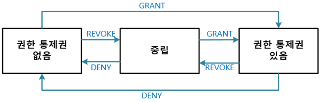

# 정보보호기술 (5강 - 2020.04.07)

## 시스템 보안

---

### 운영체제와 계정관리

`시스템`

- 필요한 기능을 실현하기 위해서 관련 요소를 어떤 법칙에 따라 조합한 집합체
- 정보를 처리하는데 이용되는 프로그램들, 절차들, 데이터 및 기긱들의 다양한 집합이나 조합

<br/>

`시스템 관련 요소`

- 하드웨어 : 모니터, 키보드, 메인보드, 하드 디스크, 램 메모리
- 소프트웨어 : 운영체제, 데이터베이스, 웹 서비스

<br/>

`시스템보안`

- 사용 허가권이 없는 사용자가 파일, 라이브러리 폴더 및 장치 등을 사용하지 못하도록 제한하여 보호하는 시스템 기능

- 보안 요소

  - 계정관리
  - 세션관리
  - 접근통제
  - 권한관리
  - 로그
  - 취약점관리

<br/>

`운영체제`

- 컴퓨터 사용자와 컴퓨터 하드웨어 사이에서 중간자의 역할을 하는 프로그램

- 사용자의 프로그램들을 실행함

- 사용자의 문제들을 쉽게 해결하도록 함

- 사용자에게 편리하도록 컴퓨터 시스템을 만듦

- 메모리, 파일, 입출력 장치, 프로세서 등과 같은 모든 시스템 자원을 관리함

- 다양한 응용 프로그램의 운영을 위하여 이들이 요구하는 자원의 가용성을 최적화 시킴

- 컴퓨터 시스템 보안의 기본적인 제공자임

- 다양한 프로그램 개념을 지원하고 다중 프로그래밍과 자원의 공유를 허용함

- 프로그램 행위에 대한 제약을 규정하고 다수 사용자에 의한 시스템의 동시 사용을 지원함

- MS-DOS, Windows, OS/2, Mac OS, UNIX, LINUX

<br/>

`운영체제 보안`

- 우연한 또는 의도적인 방해로부터 사용자의 정보처리를 보호할 수 있는 방법

- 운영체제보안의 기능

  - 사용자 인증
  - 파일 보호
  - 메모리 보호
  - 접근 통제

<br/>

`보호대상객체 : 운영체제가 관리하는 객체들`

- 여러 프로그램에 의하여 공유될 때 운영체제에 의하여 충분한 보호가 이루어져야 함

- 대상

  - 메모리
  - 공유 및 재사용이 가능한 I/O 장치
  - 공유 가능한 프로그램 및 서브 프로그램
  - 공유 데이터

<br/>

`운영체제 보안을 위한 분리`

| 분리방법    | 내용                                                                                       |
| ----------- | ------------------------------------------------------------------------------------------ |
| 물리적 분리 | 서로 다른 보안 수준을 요구하는 프로세스별로 분리된 물리적 객체를 사용함                    |
| 시간전 분리 | 서로 다른 보안 요구사항을 갖는 프로세스들은 서로 다른 시간에 운영됨                        |
| 논리적 분리 | 운영체제는 프로그램의 접근을 제한하여 허용된 영역 밖의 객체에 대해서는 접근할 수 없도록 함 |
| 암호적 분리 | 다른 프로세스가 인식할 수 없는 방법으로 자신의 데이터와 계산을 감춤                        |

<br/>

`보안운영체제 (Secure Operating System)`

- 운영체제의 내재적인 보안성의 결함으로 인한 각종 침해로부터 시스템을 보호하기 위해 사용함
- 기존의 운영체제 내에 보안 기능을 통합시킨 보안 커널(Secure Kernel)을 추가적으로 이식한 운영 체제임

<br/>

`계정 (Account)`

- 각종 PC통신 서비스 또는 네트워크에서 각 사용자를 구별하는 단위
- 특정 컴퓨터나 네트워크를 이용하기 위한 권리를 의미하며, PC통신에서는 사용자 ID라는 명칭으로 사용됨
- 계정의 기본 구성요소는 ID와 패스워드
- 하나의 계정은 식별과 인증으로 접근을 허용 받음

<br/>

`운영체제의 계정 확인`

- 계정 생성과 삭제시 적절한 승인 절차가 마련되어 있어야 함
- 불필요한 계정이 존재하는 지와 불필요하게 관리자 권한 등이 부여되어 있지 않은지를 주기적으로 확인해야 함

<br/>

`UNIX 계정관리`

- 기본 관리자 계정으로 root가 존재함
- 유닉스 계정 목록 확인: /etc/passwd 파일
- 관리자 계정과 일반사용자 계정 확인

<br/>

`Unix의 /etc/passwd 파일의 구성`

`Root(1):x(2):0(3):0(4):Root(5):/Root:/bin(6)/bash(7)`

| 번호 | 의미                                                                                                                                       |
| ---- | ------------------------------------------------------------------------------------------------------------------------------------------ |
| (1)  | 사용자 계정                                                                                                                                |
| (2)  | 패스워드가 암호화되어 Shadow 파일에 저장되어 있음을 나타냄                                                                                 |
| (3)  | 사용자 번호                                                                                                                                |
| (4)  | 그룹 번호                                                                                                                                  |
| (5)  | 실제 이름: 시스템 설정에 영향이 없는 것 자신의 이름을 입력해도 됨                                                                          |
| (6)  | \* 사용자의 홈 디렉토리 설정<br/>\* 예) 관리자 : 홈 디렉토리는 /Root<br/>\* 일반 사용자 : /home/wishfree와 같이 /home 디렉토리 하위에 위치 |
| (7)  | \* 사용자의 쉘 정의<br/>\* 기본설정 : bash 쉘<br/>\* 사용하는 쉘을 이곳에 정의                                                             |

<br/>

`Unix의 /etc/passwd 파일의 구성`

- 관리자 권한은 사용자와 그룹 번호로 식별하며, 관리자는 사용자 번호가 0, 그룹 번호도 0임
- root 이외에 사용자 번호가 0번인 계정이 존재하면, 그 계정도 관리자 권한을 가짐

<br/>

`Unix 그룹 목록 확인 : /etc/group 파일에서 확인`

`Root:x:0:Root`

| 번호 | 의미                                                                                                  |
| ---- | ----------------------------------------------------------------------------------------------------- |
| (1)  | 그룹 이름 : Root 그룹                                                                                 |
| (2)  | 그룹에 대한 패스워드 설정하는데 일반적으로 설정되지 않음                                              |
| (3)  | 그룹 번호 : 0은 Root 그룹                                                                             |
| (4)  | \* 해당 그룹에 속한 계정 목록<br/>\* 완전하지 않기 때문에 패스워드 파일과 비교해보는 것이 가장 정확함 |

<br/>

`데이터베이스의 계정 관리`

- MS-SQL에서는 윈도우의 관리자계정으로 데이터베이스에 로그인할 수 있지만 오라클에서는 할 수 없음

- 운영체제와 데이터베이스 계정이 완전히 분리되어 있지 않은 경우 데이터베이스 계정 이외에 운영체제의 계정을 잘 확인 해야 함

- 관리자 계정

- 일반 사용자 계정

- MS-SQL에서 관리자 계정 : sa(system administrator)

- 오라클에서 관리자계정은 sys, system으로 둘 다 관리자 계정임

  - system은 sys와 달리 데이터베이스를 생성할 수 없음

- 오라클은 Scott이라는 기본 계정이 존재함

  - 솔루션을 설치하거나 테이블을 생성할 때 관련 계정이 자동으로 생성되는 경우가 많음

<br/>

`세션 관리`

- 세션을 적절히 유지하기 위한 보안 사항

- 세션 하이재킹 또는 네트워크 패킷 스니핑에 대응하기 위한 암호화

- 세션에 대한 지속적인 인증(Continuous Authentication)

  - 인증 절차를 거져 시스템에 접근하는 데 성공했다면 얼마 후 같은 아이디로<br/>
    시스템에 접근하는 사람이 인증에 성공한 처음의 그 사람인가라는 의문에 대한<br/>
    해답을 찾기 위한 방책<br/>

  - 윈도우 : 화면보호기

  - 유닉스 : /etc/default/login이나 /etc/profile과 같이 사용자의 일반 환경을<br/>
    설정하는 파일에서 타임아웃 값을 명시적으로 설정<br/>

<br/>

### 접근통제와 권한 관리

`운영체제 접근통제`

`접근통제란? (Access Control)`

- 주체가 객체에 접근을 요구했을 때 이 요구를 수락 할지를 결정하는 행위
- 적절한 권한을 가진 인가자만이 특정 시스템이나 정보에 접근할 수 있도록 통제하는 것
- 접근제어라고도 함

<br/>

| 운영체제             | 서비스 이름   | 사용 포트 | 비고                                    |
| -------------------- | ------------- | --------- | --------------------------------------- |
| 유닉스 (리눅스 포함) | Telnet        | 23        | 텔넷 : `스니핑, 세션 하이재킹공격 취약` |
| 유닉스 (리눅스 포함) | SSH           | 22        | SFTP 가능                               |
| 유닉스 (리눅스 포함) | XDMCP         | 6000      | 유닉스용 GUI(Xmanager)                  |
| 유닉스 (리눅스 포함) | FTP           | 21        | 파일 전송 서비스 : `스니핑 공격 취약`   |
| 윈도우               | 터미널 서비스 | 3389      | 포트 변경 가능                          |
| 윈도우               | GUI 관리용 툴 | -         | VNC, Radmin 등..                        |

<br/>

`TCPWrapper를 통한 접근통제`

- 시스템에 대한 접근통제정책

  - 기본적으로 IP를 통해 수행함

- 유닉스의 Telnet, SSH, FTP등

  - TCPWrapper를 통해 접근통제 가능함

- inetd 데몬 (Internet service daemon)

  - Super-server Daemon으로 클라이언트로부터 Inetd가 관리하고 있는 Telnet이나 SSH, FTP 등에 대한 연결 요청 받음

  - 해당 데몬을 활성화시켜 실제 서비스를 하는 데몬과 클라이언트의 요청을 연결하는 역할

- XDMCP (X Display Manager Control Protocol)

  - TCPWrapper의 통제를 받지 않는 데몬
  - 별도의 접근통제 설정 파일을 통해 클라이언트 IP에 대한 접근통제를 설정해야 함

- 윈도우
  - 자체적으로 제공하는 IP 기반 접근통제가 없고 시스템에 설치된 방화벽 등을 통해 IP접근통제를 수행해야 함

<br/>

`데이터베이스 접근통제`

- `$ORACLE_HOME/network/admin/sqlnet.ora`파일에서 IP에 기반한 접근 제어 설정

- 200.200.200.100과 200.200.200.200라는 두 IP의 접근을 허용하고자 할 때 추가

  - tcp.invited_nodes = (200.200.200.100, 200.200.200.200)

- 200.200.200.150의 접근을 차단하고자 할 때 추가

  - tcp.excluded_nodes = (200.200.200.150)

- MS-SQL은 운영체제처럼 IP에 대한 접근 제어를 기본으로 제공하지 않음

<br/>

`유닉스 권한 관리`

- 유닉스는 파일 및 디렉토리에 대한 권한 설정 방법이 모두 같음

- ls -al 명령으로 해당 디렉토리 내용을 확인함

- 파일의 종류와 권한
  - `-(a)rw-(b)r--(c)r--(d)`
    - (a) : 파일 및 디렉토리의 종류 (-: 일반파일, d: 디렉토리)
    - (b) : 파일 및 디렉토리 소유자의 권한
    - (c) : 파일 및 디렉토리 그룹의 권한
    - (d) : 제 3의 사용자에 대한 권한
    - 읽기(r: read), 쓰기(w: write), 실행(x: execute)의 권한을 부여함
    - 권한은 숫자로 표기할 수도 있음 (읽기는 4, 쓰기는 2, 실행은 1로 바꾸어 환산)
      - (rw-- r-- r-- = 42- 4-- 4-- = 644)

<br/>

`윈도우 권한 관리`

- 윈도우에서 디렉토리 및 파일에 대해 설정되는 접근 권한의 규칙

  1. NTFS 접근 권한은 누적
  2. 파일에 대한 접근 권한이 디렉토리에 대한 접근 권한보다 우선
  3. '허용'보다 '거부'가 우선

- 윈도우에서는 파일 및 디렉토리에 대한 권한을 cacls 명령으로도 확인할 수 있음

- 윈도우NT 4.0 이후부터는 NTFS(New Technology File System)를 기본 파일 시스템으로 사용함

| 종류               | 설명                                                                                                           |
| ------------------ | -------------------------------------------------------------------------------------------------------------- |
| 모든 권한          | 디렉토리에 대한 접근 권한과 소유권을 변경할 수 있으며,<br/>하위에 있는 디렉토리와 파일을 삭제할 수 있음        |
| 수정               | 디렉토리를 삭제할 수 있음<br/>읽기 및 실행과 쓰기 권한이 주어진 것과 같음                                      |
| 읽기 및 실행       | 읽기를 수행할 수 있으며, 디렉토리나 파일을 옮길 수 있음                                                        |
| 디렉토리 내용 보기 | 디렉토리내의 파일이나 디렉토리의 이름을 볼 수 있음                                                             |
| 읽기               | 디렉토리의 내용을 읽기만 할 수 있음                                                                            |
| 쓰기               | 해당 디렉토리에 하위 디렉토리와 파일을 생성할 수 있으며,<br/>소유권이나 접근 권한의 설정 내용을 확인할 수 있음 |

<br/>

`데이터베이스 권한 관리`

`질의문(Query)에 대한 권한 관리`

- DDL (Data Definitioin Language)

  - 데이터 구조를 정의하는 질의문으로, 데이터베이스를 처음 생성하고 개발할 때<br/>주로 사용하고 운영중에는 거의 사용하지 않음

  <br/>

  | 질의문 | 의미                                          |
  | ------ | --------------------------------------------- |
  | CREATE | 데이터베이스 객체를 생성함                    |
  | DROP   | 데이터베이스 객체를 삭제함                    |
  | ALTER  | 존재하는 기존 데이터베이스 객체를 다시 정의함 |

- DML (Data Manipulation Language)

  - 데이터베이스의 운영 및 사용과 관련해 가장 많이 사용하는 질의문으로,<br/>
    데이터의 검색과 수정 등을 처리함

   <br/>

  | 질의문 | 의미                                          |
  | ------ | --------------------------------------------- |
  | SELECT | 사용자가 테이블이나 뷰의 내용을 읽고 선택함   |
  | INSERT | 데이터베이스 객체에 데이터를 입력함           |
  | UPDATE | 기존 데이터베이스 객체에 있는 데이터를 수정함 |
  | DELETE | 데이터베이스 객체에 이쓴ㄴ 데이터를 삭제함    |

- DCL (Data Control Language)

  - 권한 관리를 위한 질의문

  <br/>

  | 질의문 | 의미                                          |
  | ------ | --------------------------------------------- |
  | GRANT  | 데이터베이스 객체에 권한을 부여함             |
  | DENY   | 사용자에게 해당 권한을 금지함                 |
  | REVOKE | 이미 부여된 데이터베이스 객체의 권한을 취소함 |



<br/>

`뷰(View)`

- 각 사용자에 대해 참조 테이블의 각 열에 대한 권한을 설정하는 것이<br/>
  매우 번거롭고 관리가 어려워 만든 가상 테이블<br/>

<br/>

### 로그 및 취약점 관리

`AAA`

- 시스템의 사용자가 로그인하여 명령을 내리는 과정에 대한 시스템의 동작을 다음과 같이 구분함

| 구분                  | 설명                                                                                                                                                                          |
| --------------------- | ----------------------------------------------------------------------------------------------------------------------------------------------------------------------------- |
| Authentication (인증) | \* 자신의 신원(Identity)을 시스템에 증명하는 과정<br/>\* 가장 일반적인 경우가 아이디와 패스워드를 입력하는 과정<br/>\* 아이디가 신원을 나타내고 패스워드가 정상이면 인증이 됨 |
| Authorization (인가)  | \* 올바른 패스워드를 입력해 시스템에 로그인이<br/>허락된 사용자라고 판명되어 로그인 되는 과정                                                                                 |
| Accounting            | \* 접근한 객체나 파일에 대한 기록<br/>\* 추적을 위한 로그의 충실도를 책임 추적성(Accountability)이라 함                                                                       |

<br/>

`로그 (Log)`

`로그 대상`

- AAA의 정보가 로그가 수행되는 대상이며, 어떤 정보를 로그로 담길지를 이 AAA 개념에 따라 판단함

<br/>

`감사추적 (Audit Trail)`

- Accounting 하여 남긴 로그 정보를 통한 추적 자체를 말함

<br/>

`윈도우 로그`

- 이벤트(Event)라고 부르는 중앙 집중화된 형태로 로그를 수집저장함

  - 윈도우 로그의 종류

    | 로그 정책                   | 내용                                                                                                                                                               |
    | --------------------------- | ------------------------------------------------------------------------------------------------------------------------------------------------------------------ |
    | 개체 액세스 감사            | \* 개체로 표현되는 파일과 시스템의 각 자원에 대한 접근 기록을 로그로 남김                                                                                          |
    | 계정 관리 감사              | \* 사용자 계정 생성, 암호 변경 시도, 사용자 계정 잠김, 사용자 관련 정책 변경에 대한 로그를 남김                                                                    |
    | 계정 로그온 이벤트 감사     | \* 로그인 성공/실패 정보에 대한 로그를 남김                                                                                                                        |
    | 권한 사용 감사              | \* 권한 설정 변경이나 권리자 권한이 필요한 작업을 수행할 때만 로그 남김<br/>\* 공격자가 계정을 생성하여 관리자 권한을 부여하거나 이에 준하는 일을 수행할 경우 남김 |
    | 디렉터리 서비스 액세스 감사 | \* 액티브 디렉토리와 관련된 로그를 남김                                                                                                                            |
    | 로그온 이벤트 감사          | \* 계정 로그온 이벤트 감사와 역할이 비슷하지만, 좀 더 상세한 정보를 로그로 남김                                                                                    |

- 이벤트 뷰어 : 로그 열람 기능을 제공한다.

  - 운영체제 수준에서 남기는 거의 모든 로그를 이 기능을 통해 볼 수 있음

  - 이벤트 뷰어에 표시되는 내용

  | 구분       | 내용                                                                                                                 |
  | ---------- | -------------------------------------------------------------------------------------------------------------------- |
  | 종류       | \* 성공 감사 : 어떤 시도가 성공했을 때 남기는 로그<br/>\* 실패 감사 : 어떤 시도가 실패했을 때 남기는 로그            |
  | 날짜, 시간 | \* 로그를 남긴 날짜와 시간                                                                                           |
  | 원본, 범주 | \* 로그와 관계 있는 영역                                                                                             |
  | 이벤트     | \* 윈도우에서는 각 로그별로 고유한 번호 부여<br/>\* 로그를 분석할 때 이 번호를 알고 있으면 빠르고 효과적인 분석 가능 |
  | 사용자     | \* 관련 로그를 발생시킨 사용자                                                                                       |
  | 컴퓨터     | \* 관련 로그를 발생시킨 시스템                                                                                       |

- 윈도우 2003 : 최소한의 로그가 기본으로 설정되어 있어 시스템에 남겨진 로그를 확인할 수 있음

<br/>

`유닉스 로그`

- 여러 곳에 산발적으로 저장되어 찾기가 쉽지 않음
- 주요 시스템의 로그 디렉토리 위치

  | 경로     | 적용 시스템                                                           |
  | -------- | --------------------------------------------------------------------- |
  | /usr/adm | 초기 유닉스, BSD 계열 : HP-uX 9.X, SunOS 4.x                          |
  | /var/adm | 최근 유닉스, SVR 계열 : SUN 솔라리스, HP-UX 10.x 이후, IBM AIX        |
  | /var/log | 일부 BSD 계열: BSD, FreeBSD, SUN 솔라리스(SUN Solaris), 리눅스(Linux) |
  | /var/run | 일부 리눅스                                                           |

- 유닉스 로그의 종류

  | 로그 파일명 | 설명                                                                                          |
  | ----------- | --------------------------------------------------------------------------------------------- |
  | aculog      | \* 다이얼 아웃 모뎀 관련 로그 기록                                                            |
  | lastlog     | \* 각 사용자의 로그인 아이디, 포트, 최근 로그인 사용자 기록                                   |
  | loginlog    | \* 실패한 로그인 시도를 기록                                                                  |
  | messages    | \* 부트 메시지 등 콘솔에서 출력된 결과를 기록<br/>\* syslog에 의해 생성된 메시지 기록         |
  | sulog       | \* su 명령어 사용 내용 기록                                                                   |
  | utmp        | \* 현재 로그인한 사용자의 아이디, 사용자 프로세스,<br/>실행 레벨, 로그인 종류 등이 기록       |
  | utmpx       | \* utmp 기능을 확장한(extended utmp)로그<br/>\* 내용 : utmp와 같음                            |
  | wtmp        | \* 사용자의 로그인/로그아웃 시간과 IP/세션 지속 시간 기록<br/>\* 시스템의 종료/시작 시간 기록 |
  | wtmpx       | \* wtmp 기능 확장                                                                             |
  | void.log    | \* 플로피 디스크나 CD-ROM과 같은 외부 매체의 사용에서 발생하는 에러 기록                      |
  | xferlog     | \* FTP 접속 기록                                                                              |

<br/>

`데이터베이스 로그`

- 모든 접근 및 실행 SQL 문에 대해 로그를 남길 수 있음

- 로그를 활성화시키면 CPU 점유율이 30% 가량 상승하는 시스템 자원의 문제 발생

  - 보안보다 데이터베이스 운영상의 문제점을 확인하기 위해 필요할 때만 활성화시키고<br/>
    평소에는 데이터베이스에 대한 간단한 접근 로그만 남기는 것이 일반적임<br/>

- MS-SQL 2000애서는 로그인 시도에 대한 실패와 성공 로그를 각각 남길 수 있음

- 별도의 데이터베이스 모니터링 툴 도입

  - 데이터베이스 로그 생성과 보존

  - 데이터베이스에 대한 로그를 남기는 가장 좋은 방법

  - 네트워크에 네트워크 트래픽을 모니터링할 수 있는 태핑(Tapping)장비를 설치하고,<br/>
    네트워크 패킷 중 데이터베이스 질의문을 확인하여 이를 로그로 남김<br/>

<br/>

`취약점 관리`

`패치(Patch)`

- 일반적으로 이미 발표된 소프트웨어 제품에서 발견된 사소한 기능 개선 또는 버그나 오류 등을<br/>
  수정하기 위해 개발자(개발회사)가 내놓는 업데이트 프로그램<br/>

<br/>

`응용 프로그램의 보안 설정`

- 응용 프로그램의 잘못된 설정이 공격자가 운영체제에 침투하는 경로를 제공하는 경우가 많음

- 운영체제 뿐만 아니라 응용 프로그램에 대한 보안 설정도 매우 중요함

- 응용 프로그램의 실행 프로세스 권한 설정

  - 공격자는 응용 프로그램의 취약점을 통해 해당 프로세스의 운영체제 권한을 얻는 것이 가능함
  - 데이터베이스나 다른 응용 프로그램도 필요에 따라 프로세스의 실행 권한을 제한해야 함

- 특히 웹은 취약점이 많아 노출될 수 있음

```
윈도우 : IIS에서 그 실행 프로세스 권한을 별도로 만들어 사용해야 함
유닉스 : nobody와 같이 제한된 계정 권한을 사용해야 함
```

- 응용 프로그램을 통한 운영체제의 접근 제한

  - 응용 프로그램 중에는 해당 응용 프로그램을 통해 운영체제의 파일이나 명령을 실행시킬 수 있는 것이 있음
  - MS-SQL의 xp_cmdshell은 데이터베이스를 통해 운영체제의 명령을 실행하고, 파일 등에 접근할 수 있음
  - 응용 프로그램의 동작과 관련하여 운영체제에 접근할 수 있는 함수나 기능이 있으면 그 적절성을 검토해야 함

- 응용 프로그램을 통한 운영체제의 정보수집 제한

  - 응용 프로그램이 운영체제에 직접적인 영향을 미치지 않아도 응용 프로그램의 특정 기능이 운영체제의 정보를 노출시키기도 함

  - 유닉스에서 이메일을 보낼 때

    - 일반 계정 vrfy(verify) = (수신자가 있는 시스템의 sendmail 데몬에 해당 계정이 존재하는지 확인) = 그룹 expn(expansion)

  - 일반 사용자는 Telnet을 이용해 시스템에 존재하는 계정의 목록을 어느 정도 파악할 수 있음

  - 응용 프로그램의 기능은 제한하는 것이 바람직함

- 불필요한 서비스 및 악성 프로그램의 확인과 제거

  - 현재 동작중인 서비스 확인

    - 대표적인 불필요한 서비스 (SNMP (Simple Network Management Protocol), 메신저 서비스)

    - 악성프로그램의 프로세스에는 설명이 없고 대부분 빈칸이므로 설명부분을 보고 서비스를 구별함

    - 시스템에 동작 중인 악성 프로그램을 확인하기 위해 현재 동작중인 프로세스를 확인하는 것도 매우 중요함

    | 구분   | 설명                                                      |
    | ------ | --------------------------------------------------------- |
    | 유닉스 | ps -ef 명령을 통해 시스템에서 운영 중인 프로세스를 확인함 |
    | 윈도우 | [Windows 작업 관리자] 창을 이용하여 프로세스 확인         |

<br/>

`기타 취약점 관리`

- 열린 포트 확인

  - 악성 프로그램이나 운영 중인 서비스는 열린 포트를 통해서도 확인할 수 있음
  - 윈도우와 유닉스 모두 netstat -an 명령으로 확인 가능

- 악성 프로그램 탐지 툴 이용

  - 잘 알려진 악성 프로그램은 대부분 백신 툴 등을 통해 탐지와 제거 가능
  - 리눅스나 유닉스에서는 이런 툴이 많아 부족하기 때문에 수동으로 해야 할 경우가 많음

- 무결성 검사

  - 시스템에 어떤 변화가 일어나는지 테스트

  - 해시함수를 사용하여 무결성을 검증함

    - 기존 MD5 해시 기법을 많이 사용

  - 관리자 : 주요 파일의 해시값을 주기적으로 수집하여 검사하여 변경되는<br/>
    파일의 내용을 확인하고 이에 대한 조치를 할 수 있음<br/>

<br/>
