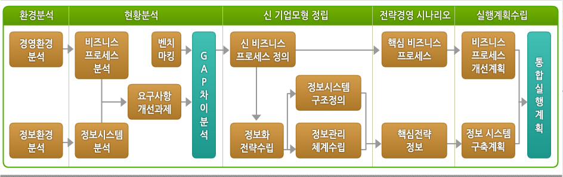
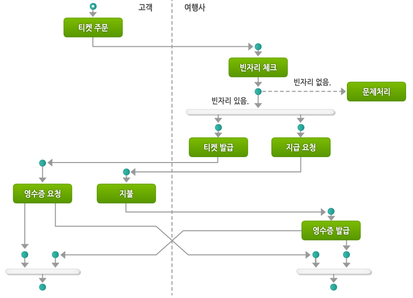

# 소프트웨어 공학 개요 (5강 - 2020.04.05)

## 소프트웨어 요구사항 분석

---

### 소프트웨어 요구사항

`요구사항`

- 시스템이 가져야 할 기능이나 시스템이 만족해야 할 조건

- 시스템이 제공하여야 할 서비스나 제약조건을 글로 기술하거나, 수학 기호 등으로 표현하거나 하는 방법

  - 프로젝트 관련자들이 이를 명확히 공유하여야 함

- 요구사항의 정확한 분석과 기록관리 '명세'는 프로그램 수주자인 고객이나 
  현업 담당자와 프로젝트 진행대상자의 관계를 명확하게 해줌 

- 요구사항의 명세 '기록'은 분석, 설계, 구현, 테스트, 오픈 '배포'등 
  전 프로젝트 전반의 기준이 됨 

 

`기능적, 비기능적 요구사항`

- 기능적 요구사항

  - 시스템이 어떤 기능을 갖추어야 하는지를 요구하는 사항
  - ex) 본 워드 프로세스 프로그램에는 저장기능이 필요함.

- 비기능적 요구사항

  - 기능적인 부분 이외의 요구사항
  - ex) 개발을 빠른 시간 내에 완료해 달라.

 

`사용자 요구사항`

- 기능적, 비기능적인 요청사항들을 모아 자세히 분석하고 명세화 하여 사용자 요구 사항을 작성함.

 

`시스템 요구사항`

- 작성된 사용자 요구사항을 분석하여 이를 시스템으로 구성하기 위하여 
  어떠한 요구사항이 필요한지에 대하여 시스템 차원에서 좀 더 요구 사항을 확장하여 명세화함. 

- 시스템 구성, 하드웨어 필요 자원등이 필요함.

 

`인터페이스 명세`

- 구현될 시스템이 기존 시스템과 같이 운영되어야 한다면, 기존의 시스템과 새로 만들어질 시스템의 인터페이스 
  `입출력, 프로시져(프로그램 호출 함수 단위), 데이터 구조 등`에 대하여 분석하는 작업 

 

`요구사항 프로세스`

- 요구사항을 명확히 분석하고자 하는 진행 순서인 요구 공학 프로세스

- 요구 사항은 타당성 검증 후 분석하여 문서화 한 후 프로젝트 내내 이를 참고하여 개발하고 최종 목적물과도 비교해야 함.

- 절차

  1. 타당성 조사 : 사용자의 요구사항이 구현 및 실행가능한지 타당성을 조사함.
  2. 요구사항 추출 및 분석 : 조사된 요구사항을 추출하여 분석하여 명세화(시스템 모델화) 함.
  3. 요구사항 검증 : 명세화된 요구사항에 대하여 검증함.
  4. 요구사항 관리 : 프로젝트 진행 중 및 최종과정에서 요구사항이 정확히 반영되고 있는지 계속 추적하고 관리함.

 

`요구사항 검증`

- 검토내용 : 시스템의 구성 및 아키텍처등에 대한 사용자 요구사항이 충분히 도출되고 명세화되었는지 점검함.

  - 시스템 성능 측면
  - 가용성 및 확장성 측면
  - 보안 및 안정성 측면

- 목적

  - 시스템 성능, 가용성, 확장성, 보안 및 안전성에 대한 사용자 요구사항이 업무특성에 맞도록 
    적절하게 도출되었는지를 확인하여 목표시스템 아키텍처 설계에 반영되도록 하는 것이 1차적인 목적임. 

  - 궁극적으로는 오픈 이후 서비스를 안정적으로 제공하는 것임.

- 점검 기준

  - 요구사항의 도출 절차가 적절하였는지 검증함.

  - 산출물이 안전성, 보안성, 효율성 측면으로 도출되었는지 검증함.

 

`요구사항 관리`

| 세부사항          | 내용                                                           |
| ----------------- | -------------------------------------------------------------- |
| 요구사항 협상     | 가용한 자원과 수용 가능한 위험수준에서 구현 가능한 기능 협상   |
| 요구사항 기준선   | 공식적으로 합의되고 검토된 요구사항 명세서 결정                |
| 요구사항 변경관리 | 요구사항 기준선을 기반으로 모든 변경을 공식적으로 통제         |
| 요구사항 관리     | 구축된 시스템이 이해관계자가 기대한 요구사항에 부합되는지 확인 |

 

### 시스템 모델

`구조적 분석 모델`

- 데이터(자료)보다는 함수 또는 프로세스에 중점을 두고 분석하는 방식으로 프로세스를 먼저 정하고 
  프로세스의 입출력을 정하면서 분석하는 방법 : 지금까지 가장 많이 사용해온 방법 

- 구조적 분석의 기본 생각

  - 프로세스의 흐름을 GOTO 분기 대신에 3개 논리적인 구조(Consturcts)인 순차(Sequencing), 
    선택(Selection), 반복(Iteration)으로 구성하여 흐름의 복잡성을 감소한다는 사상임 

  - 요구사항을 구조적 절차에 의하여 분석하는 방법임.

    - 시스템 성능 측면 : 가장 많이 사용됨
    - 자료흐름도 (DFD)
    - 전체요구사항을 먼저 분석한 후 이를 상세한 요구사항으로 분석하는 방법등..

 

`DFD의 구성`

- Process : 자료가 처리되는 과정
- External Entity : 외부실체
- Data Store : 저장되는 장소
- Data Flow : 데이터의 흐름표시

 

`객체지향 분석 모델`

- 하나의 일의 단위를 객체라는 개념으로 보고 객체와 객체의 관계를 파악하는 방법으로 분석함.
- 객체지향 분석을 기록하는 방법의 UML(unified modeling language)이 많이 사용함.
- UML로 표기하는 방법
  - Class Diagram
  - Activity Diagram
  - State Machine Diagram 등..

 

 

`정보공학 분석 모델`

- 자료와 자료들 사이의 관계를 우선파악하고 자료에 대한 오퍼레이션 패턴으로 프로세스를 묶어가는 방법
- 구조적 분석 모델의 약점을 보완하기 위하여 기업의 업무 중심의 관점에서 분석작업을 수행함
- 프로젝트를 관리 가능한 단위로 분할하여 관리하며 데이터와 프로세스의 균형을 유지하는 관점

 

 

`정형화 분석 모델`

- 단위 업무 프로세스의 상태에 대하여 논리적 표현을 중심으로 분석하는 방법

 

### 요구사항 명세

`중대한 시스템의 명세`

- 중대한 시스템에 대한 요건분석과정은 보다 면밀한 분석이 필요함.
- 위험중심, 안전성, 보안성, 소프트웨어 신뢰성 차원으로 요건을 분석하여야 함.

| 구분                   | 내용                                                                                                                                 |
| ---------------------- | ------------------------------------------------------------------------------------------------------------------------------------ |
| 위험 중심 명세         | \* 시스템의 요구사항을 위험중심으로 나열하는 방법 \* 위험을 식별하고 분석,분류하고 제거하거나 감소시키는 방법을 나열하여 기록함. |
| 안전성 명세            | \* 시스템 요구사항을 어느 수준의 안전성을 바탕으로 하여야 한다고 정의하여 기록함.                                                    |
| 보안성 명세            | \* 시스템 요구사항을 보안성 차원에서 정의하여 기록함.                                                                                |
| 소프트웨어 신뢰성 명세 | \* 시스템 요구사항을 소프트웨어의 신뢰성 기준으로 정의하여 기록함.                                                                   |

 

`정형 명세`

- 요구사항을 기술하여, 명세하는 방법을 수학과 논리학에 기반을 두어 
  자연언어가 내포하는 애매모호함이나 불확실성을 제거하는 명세 기법 

  - 요구사항을 분석하는 중요한 방법

 

`정형 명세 사례`

- 서브 시스템 사이의 연결 인터페이스를 명세하는 방법으로 여러 정형화된 명세를 사용함.
- 행위나 상태를 명세하는 방법으로도 여러 정형화된 명세를 사용함.
- 시스템 모델의 대부분은 정형 명세를 사용함.

  - UML, Petri-Net, 순서도, DFD와 같은 방법으로 요구사항을 표시하는 방법 모두 해당

- 일반적으로 요구사항을 분석 후 이를 정형화된 기호나 도표 등으로 명세화함.

 
